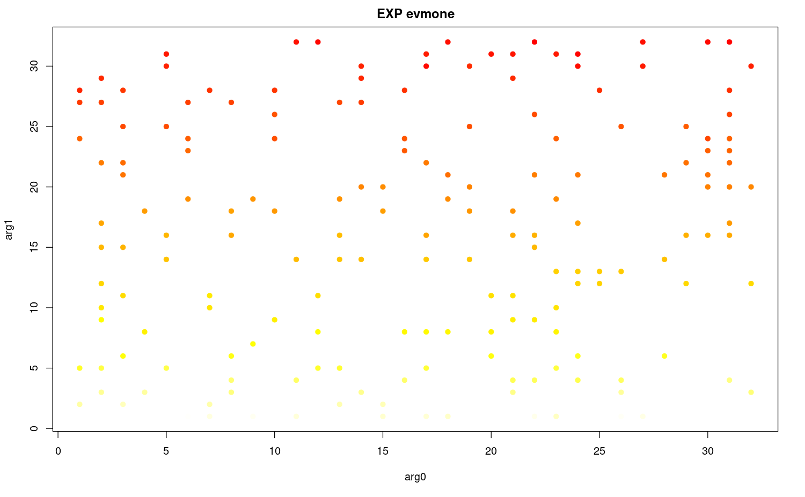

# Gas Cost Estimator - Stage II Report

**TODO** fill authors

**Abstract**

We summarize the findings of the second stage of the "Gas Cost Estimator" research project. A method of estimating gas costs of EVM OPCODEs by means of estimating their marginal execution cost is proposed. We provide arguments for this method to be a feasible way of assessing the costs of EVM OPCODEs. The procedure to obtain the measurements is also standardized and tooling provided. We discuss the difference between different EVM implementations and compare the obtained alternative gas cost schedule with the current one.

## Introduction

> **NOTE** This report copies some generic portions of the "Stage I Report".

EVM (Ethereum Virtual Machine) is instrumental to the functioning of the Ethereum blockchain.
It is responsible for carrying out the computations associated with transactions on the Ethereum blockchain, namely those related to the functioning of smart contracts.
Due to Turing completeness of their instruction sets, and the necessity to guarantee that computations can be securely performed in an open, distributed network, a halting mechanism must be provided.

The halting mechanism is provided thanks to gas, which is an Ethereum specific measure of computational cost incurred by the executing environment (Ethereum node connected to the network).
Gas is priced in Ether (the intrinsic value token of the Ethereum blockchain), each transaction has an allowance of gas prepaid by the transaction sender.
Every step of computation (as of writing, this corresponds to every bytecode instruction interpreted by EVM) costs a small amount of gas, and if gas allowance is depleted, the computation is halted and its effects are reverted, except for the consumption of the entire gas allowance.
The gas consumed by computations performed is paid out as transaction fee (in Ether) to the miner (validator), including the transaction.
The unused remainder of the prepaid gas allowance is returned back to the transaction sender.

The challenge with this mechanism is to determine adequate gas costs of bytecode instructions.
Currently, gas cost is determined on a per-OPCODE basis, that is, every OPCODE interpreted by the EVM has a predetermined gas cost (sometimes gas cost expressed as a function of instruction's arguments is added).
This report and the "Gas Cost Estimator" research project aims at devising a method to estimate adequate values for these OPCODE gas costs, by estimating and analyzing the relative computational cost of OPCODEs.

In the remainder of this section we provide our motivation and some background of the literature on the subject.
In section **Estimation Method** we describe the proposed measurement and estimation method.
In section **Validation** we elaborate on the procedure of validating the results.
In section **Results** we provide the results obtained in various environments and discuss them in the context of an alternative gas schedule.

### Motivation

The importance of adequate gas costs arises from the nature of computations done on the Ethereum blockchain, and has been discussed by many authors.

It is intuitive that the parties participating in the network, who are responsible for validation of blockchain transactions and maintaining the state of the blockchain, are interested in fair pricing for the service they provide.
This is emphasized in [7].
Given however, that the transaction fee still is the lesser part of the block reward, as compared to PoW mining reward [1], the importance of this argument might be disputed.
It can also be stated, that it is the computational cost of PoW mining itself, which constitutes the major part of computational burden on the miner (validator).

However, adequate gas cost of computation is paramount from the perspective of network security.
Gas cost is a natural deterrent from abusing the network's capacity.
If pricing of computations was inadequate, it would mean that there are operations in EVM which are relatively underpriced, when compared to others.
This would in turn mean that adversarial actors could craft the transactions in a way which puts significant load on the network, at the same time paying disproportionately low transaction fees.
This situation opens the door to DoS attacks, which have happened and were given as main motivation for gas cost revisions in [12], [13], [14] and other research done in [8].

To add to this, there is the decentralization factor of having adequate gas costs.
The computations done by the EVM within the Ethereum network nodes are performed by all nodes in the network, regardless of whether they are mining and earning transaction fees or not.
In the situation described above, the effect of the DoS attack extends to all participants of the network, most severely impacting less performant systems running on consumer hardware.
The ability of users running nodes on consumer hardware to keep up with the execution of transactions on the blockchain is very important for preserving the decentralized nature of Ethereum.
Such arguments are present in [9].

Another motivation for this work is the indirect effect gas costs of instructions have on smart contract code.
Since the optimization done on smart contract source and intermediate code is usually targeting minimization of gas expenditure of the users of the contract, inadequate gas costs attributed to instructions might lead to skewed optimization results, whereby an optimized smart contract bytecode is not optimal from the point of view of computational cost.

The need to have balanced pricing of EVM computations is brought up in numerous works and discussions like: [10], [11].

Another threat related to inadequate gas costs is mentioned in [15].
Authors argue that such inadequate costs may lead to entire smart contracts becoming imbalanced in terms of their computational costs versus the amount of fees deduced for transacting using these contracts.
This in turn could incentivize parties who include transactions in blocks (miners / validators) towards preferring certain contracts over others, in order to maximize their returns.
This could lead to a less predictable behavior of the fee market, from the network users' perspective.
Assuming that transactions can in fact be efficiently categorized in terms of which smart contracts they execute on, one should accept the possibility of such a scenario.

It is interesting to mention that, not entirely related to the motivations of this research but in similar vein, there is also prior work aimed at estimating the computational burden of individual OPCODEs (instructions) of the Java Virtual Machine (CPU), examples are [6], [16], [17], [18].

This report and the entire "Gas Cost Estimator" project are focusing on a subset of EVM OPCODEs.
The OPCODEs in this subset (see [Appendix B: OPCODEs subset](#appendix-b-opcodes-subset) have in common that they do not include any instructions which access the Ethereum storage (e.g. `SSTORE`, `SLOAD` etc.).
On one hand, the focus on only purely computational instructions is intended and desirable, as seen from the point of view whereby the importance of on-chain computations will increase, while the extensive use of Ethereum storage will diminish.
This is driven by the current influx of Layer 2 scaling solutions, which only store the minimum amount of data, putting the burden of providing data on the transaction senders and only the burden of validating it on the smart contract [4].
On the other hand, we might consider extending the method devised here to storage-bound instructions in the future as well.

### Standardization

One of the factors that contribute to the challenge which gas cost estimation presents is the inherent multitude of environments involved.

By environments in this context we mean:
- different implementations of the Ethereum node (and EVM/Ewasm in consequence), done in different programming languages and with different mindsets
- different hardware on which this software is ran; this is exacerbated by the requirement towards the software to run reliably on both server-grade hardware and consumer-grade desktops alike
- different operating systems

Given the inclusive nature of Ethereum, we should strive to cover the broad spectrum of these environments and determine how much does the environment impact the estimated gas costs. It is desirable, that the method devised here is reasonably easily applicable in those varying environments.
To this end, the approach must be well documented and reproducible by the community.

All work has been carried out in the public GitHub repo [imapp-pl/gas-cost-estimator](https://github.com/imapp-pl/gas-cost-estimator).

### Comparison with Stage I

This is a digest of the changes made since the Stage I research and report:
- Drop Ewasm and Openethereum
- Abandon the idea of measuring individual instructions in favor of measuring marginal cost
- Provide a more confident answer to the feasibility of the method and an alternative gas cost schedule

## Estimation Method

In this section we describe in detail the method applied to estimate the gas costs.

### `measure_total` instrumentation

`measure_total` is the name of one of the methods of measurement and instrumentation introduced in the Stage I Report.
As we will see in the next sections, it is sufficient for the estimation method we are using, at the same time being relatively easy to apply.
We chose to not pursue the method `measure_all` (aka "Individual instruction measurement") which has been preliminarily chosen during Stage I.

`measure_total` takes the measurement of the interpreter loop in its entirety, starting at just before the first iteration and ending just after the program halts.
The measurement is taken using a nanosecond precision monotonic timer, as available depending on the particular EVM implementation.
We also capture the timer overhead by taking two readings of the timer without any code in between.
The timer overhead is negligible in the `measure_total` approach, orders of magnitude smaller than the measurement itself, we capture the readings of it nevertheless, as it provides a first instance of a sanity check on the collected data.

As during the measurements done for Stage I, each measurement is repeated `sampleSize` times during the lifetime of a single OS process doing the measurement, as well as the measuring OS process is started `nSamples` times, producing the total of `nSamples * sampleSize` measurements for a single program.

The benefits of measuring the entire execution of the interpreter loop are the following:
1. We are not concerned with timer resolution or overhead anymore, and we do not need to correct for it as we needed when measuring individual instructions.
2. We do not introduce factors which might impact the functioning of the EVM, namely the system calls required to capture the timer, in the middle of a running EVM program.
3. The instrumentation is much simpler and the amounts of data produced smaller.
4. The amount of changes in the interpreter code is smaller.

The main drawback is that we need to take special measures in order to be able to draw useful conclusions from the measurement obtained.

For the implementation of the instrumentation tools follow the links:
- [`geth` measurement executable](./../src/instrumentation_measurement/geth)
- [`wallclock-total` branch in forked go-ethereum repository](https://github.com/imapp-pl/go-ethereum/tree/wallclock-total)
- [`wallclock` branch in forked evmone repository](https://github.com/imapp-pl/evmone/tree/wallclock)
- [Python script to orchestrate the measurements for a batch of programs](./../src/instrumentation_measurement/measurements.py)
- [convenience `Makefile`](./../Makefile) allowing to build Docker images and run measurements within them

- if we end up using `bench` - provide rationale and discussion **TODO**

### `measure_marginal` method

We propose to use the `measure_total` instrumentation to measure programs generated in a particular way, in order to extract the OPCODEs' gas cost estimates from it.
We call this method `measure_marginal`.

Using the `measure_total` instrumentation, we cannot simply run a single instruction of the OPCODE and halt the program, because in order for the EVM to execute an OPCODE, it must prepare the stack with a suitable number (and value!) of arguments.
This is done by prepending `PUSHx` instructions.
Similarly, the number (and value!) of the instruction results, which get pushed onto the stack, will differ.
If we want to have control over the values on the stack for subsequent OPCODEs to utilize, we must append `POP` instructions to clear the stack.

The number of arguments taken off and pushed to the stack is different per every OPCODE.
If we had naively measured the different OPCODEs with their respective `PUSH`es and `POP`s around, our measurements would have been very unfair and the gas cost estimates would have been impacted by the stack management code.

> **EXAMPLE**: `program_1` is `PUSH1 PUSH1 PUSH1 ADDMOD`, `program_2` is `ADDRESS`. It would take a lot of effort and introduce error, if we were to compare `measure_total` measurements for these two.

A natural solution in the example case above would be to prepend three `PUSH1` to the `ADDRESS` program as well.
They do not impact the program execution (`ADDRESS` takes no arguments), but would balance the measurement with that of the `ADDMOD` program.

The layout of the `measure_marginal` generated program is an evolution of this thinking.

**`measure_marginal` program**: For every `OPCODE`, which removes one value from and pushes one value to the stack, generate `max_op_count` programs, such that for `0 <= op_count <= max_op_count` we have:

| | | 
|-|-|
| `PUSH1` | `max_op_count` times |
| `{OPCODE POP}` | `op_count` times |
| `POP` | `max_op_count - op_count` times |

An `op_count + 1` program differs from an `op_count` program by only a single instance of the `OPCODE` instruction.
At the same time, we have full control over the stack arguments prepared for each instance of the `OPCODE` instruction - in the simplest case we provide the same set of arguments for each instance of `OPCODE`.

This layout is naturally extended to OPCODEs which remove from and push to the stack different numbers of values.

Such programs are later used to estimate the marginal cost of every `OPCODE` we are interested in.
The estimation is based on a premise, that if we can capture the trend of increasing timer measurements (`measure_total`, see above), in function of growing `op_count`, we can conclude that the slope of this trend is proportional to the computational cost of `OPCODE`.
In other words, we are estimating the marginal increase of computational cost (time spent executing) as a function of the marginal increase of the program (by a single instance of `OPCODE`).

It turns out, that a simple linear regression is capable of capturing such trend very reliably, given some additional data clean-up measures.

For the implementation of the `measure_marginal` program generator [see here](./../src/program_generator/pg_marginal.py)

#### Additional features of `measure_marginal` programs

There is a couple of additional measures taken when generating `measure_marginal` programs:

1. For each of the OPCODEs which perform memory operations we want to preallocate memory at the start of the program.
   This is motivated by how we want to capture just the marginal OPCODE cost, irrespective of the cost of memory allocation, which is priced separately.
   The caveat here is to not do this for OPCODEs which do not require it, as the preallocation is a rather expensive operation in terms of time of execution, and it adds a prohibitive amount of noise to computationally cheap OPCODEs. Luckily, we only require the preallocation for the rather expensive OPCODEs.
   These OPCODEs are: `CALLDATALOAD`, `CALLDATACOPY`, `RETURNDATACOPY`, `MLOAD`, `MSTORE`, `MSTORE8`, `CODECOPY`.
2. `CALLDATACOPY` programs require us to keep a block of memory as the transaction call data.
   This is trivial to accomplish, given the ability to modify the EVM implementation (which we do anyway).
   The memory allocated as call data doesn't impact EVM performance in general, so it is acceptable to do this for every program executed.
3. `CODECOPY` programs require us to artificially inflate the EVM bytecode, so that copying is actually taking place.
   We do this by injecting a `STOP` OPCODE at the end of the program and then a block of arbitrary bytes.
   This again has the goal of giving the OPCODE enough bytes to copy.
4. `RETURNDATACOPY` programs require us to prepare a block of memory resulting from the execution of another contract using `CALL` (or other similar OPCODEs).
   We accomplish this by calling the identity precompiled contract and giving it the preallocated memory block as the input.
   This populates the return data for the OPCODE to copy.
5. `JUMP` and `JUMPI` programs require us to provide a valid jump destination.
   In order to keep the `measure_marginal` working as expected, we need to make the jump instruction a no-op, in order to not have to worry about managing the loop.
   We accomplish this by wrapping each instance of the jumping OPCODE in a following sequence: `PUSH3 JUMP(I) JUMPDEST`, where each `PUSH3` is responsible for pushing on the stack the `pc` value pointing to this particular `JUMPDEST`.
   This causes the jump to be "trivial", in the sense that it does not impact the program execution.
   **NOTE**, in order to respect the rules of `measure_marginal`, and be able to later reason about the marginal cost of `JUMP` and `JUMPI`, we always pad the program with "empty" sequences `PUSH3 JUMPDEST`, so that the number of `PUSH3` and `JUMPDEST` instructions is kept constant regardless of `op_count`.

#### Estimation procedure for `measure_marginal`

The procedure to estimate the marginal cost is as follows:

1. Generate the `measure_marginal` programs for `op_count` ranging from 0 to 50, in increments of 1.
2. Collect the measurement data.
   The sequence of measured programs is shuffled randomly, so that any temporary fluctuations of performance of the measuring system (exogenous to our experiment) are more or less scattered and not clustered around neighboring `op_count` values
3. Remove outliers.
   We remove outliers separately for data subsets, as divided by `op_count`, OPCODE and environment.
4. Remove bi-modality from the measurement distribution.
   For a few particular combinations of environment and OPCODE, the distribution of `measure_total` time follows a bi-modal distribution, where for certain values of `op_count` the execution time is far greater than the others.
   We discuss this phenomenon in greater detail later, but the observation here is that the `measure_marginal` trend is easy to recognize visually, i.e. regardless of which "mode" the data point falls into, the cost of execution increases at a stable pace as `op_count` increases.
   This prompts us to remove the bi-modality by subtracting the higher mode from the measurements which cluster around it.
   After this procedure the marginal cost model is fitted with high confidence.
5. Fit a linear regression model `measure_total_time = b + a * op_count`.
   `a` is the marginal cost estimation we are looking for.
   The model is fit separately for each OPCODE and environment.

The benefits of using `measure_marginal` as the measurement method are the following:
1. Everything given as the benefits of `measure_total` in section [`measure_total` instrumentation](#measure_total-instrumentation)
2. Stability of the estimation and natural way of spotting OPCODEs and environments which have inaccurate measurements - the model provides us with plenty of standard linear regression diagnostics as well as an elegant plot to validate the model.
3. The ability to measure the different OPCODEs in almost complete isolation, as we are de-facto measuring only the individual measured OPCODEs, and the impact of all the accompanying bytecode is filtered out by the regression model as constant intercept coefficient `b`.

The assessment of the models and discussion about the results is given in the [Results section](#Results).

For the implementation of the `measure_marginal` estimation scripts [see here](./../src/analysis/measure_marginal.Rmd)

### `measure_arguments` method

The cost of some OPCODEs relies on the arguments taken off the stack.
Within the scope of this research, this is the case for `EXP` and the memory OPCODEs which copy variable portions of memory `CALLDATACOPY`, `RETURNDATACOPY` and `CODECOPY`.
During the course of our research, we have established this is somewhat the case for the division OPCODES: `DIV`, `MOD`, `SDIV`, `SMOD`, `ADDMOD`, `MULMOD`.
We have however analyzed the entire set of OPCODEs in scope in order to both establish a healthy proportion of the argument cost to the OPCODE execution cost, and assess whether new arguments should be added to the list of costs.

In order to be able to measure and estimate the impact of OPCODE arguments we propose

**`measure_arguments` program**: essentially this is `measure_marginal` with a few notable differences:
- limit the `op_count` to just a handful of values. We arbitrarily chose 0, 15 and 30
- randomize the size of arguments put on the stack using `PUSH` for the OPCODEs to use. Each instance of the measured OPCODE instruction within a single program always executes with the same arguments, but they vary from generated program to generated program. We draw a random sample of such programs for every given OPCODE.

The reason to do this is to manage the dimensionality problem, which would arise if we were to analyze the marginal increase for every `op_count`.
It is also not necessary to do so, since we have reliably established the constant cost of executing the OPCODE instruction using `measure_marginal`.
We are also not measuring the argument impact for a mesh of points of the argument space (e.g. spaced in equal distances), firstly to reduce the dimensionality for the OPCODEs taking two or three arguments, secondly to prevent any undesired behavior of the statistical models due to the regularity of the mesh (e.g. where OPCODE would consequently cost less for arguments being multiples of 64 and we chose these points as our mesh).

We need to be wary of different potential functional forms of the relation between the argument value and cost.
For simplicity we derive this form based on the inspection of the code executing the OPCODEs (and of the current gas cost schedule).
We chose these functions:
- `argument_cost(arg) = arg` - for memory OPCODEs: `CALLDATALOAD`, `CALLDATACOPY`, `RETURNDATACOPY`, `MLOAD`, `MSTORE`, `MSTORE8`, `CODECOPY`
- `argument_cost(arg) = log(arg)` - for OPCODEs where the cost is proportional to the bytesize of the argument (remainder of OPCODEs)
- `argument_cost(arg) = numerator_arg > denominator_arg` - gauged towards the division OPCODES. This means that the arguments "cost" more if the OPCODE involves a `numerator / denominator` operation, and the `numerator` part is bigger.

For the implementation of the `measure_arguments` program generator [see here](./../src/program_generator/pg_arguments.py)

#### Estimation procedure for `measure_arguments`

The procedure to estimate the argument cost is as follows:

1. Generate the `measure_arguments` programs for `op_count` of 0, 15, 30.
   Each triplet has the stack arguments drawn randomly from the uniform distribution between 0 and 2^256 (0 and 2^14 for memory OPCODEs, in order to remain within the size of preallocated memory of 32kB - 16kB being the maximum offset and another 16kB as the maximum amount of memory copied).
2. Collect the measurement data.
3. Remove outliers.
   We remove outliers separately for data subsets, as divided by `op_count`, OPCODE and environment.
4. Fit a linear regression model `measure_total_time = b + a * op_count * argument_cost(arg) + c * argument_cost(arg) + d * op_count`.
   `a` is the estimation of the cost increase for a unit increase of the argument cost (either `arg` or `log(arg)`).
   The model is fit separately for each OPCODE and environment.
5. Discriminate between OPCODEs where the arguments have and do not have impact.
   We do this by looking at the p-value of the `a` coefficient.

It is worth noting, that we neglect to check the impact of the size of the second `pc_destination` argument of `JUMP` and `JUMPI` OPCODEs on purpose.
It would be quite unfeasible to compose programs which actually execute as expected, fit into the framework of our measurement method and explore the dynamics of this argument.
At the same time we find it unlikely for this argument to play a role in the cost of execution of this OPCODE.

For the implementation of the `measure_arguments` estimation scripts [see here](./../src/analysis/measure_arguments.Rmd)

### Measurement setup and environments

The instrumentation and measurement were performed for these EVMs:
1. `geth` - [ethereum/go-ethereum](https://github.com/ethereum/go-ethereum) at [`v1.10.13`](https://github.com/ethereum/go-ethereum/releases/tag/v1.10.13) with [additional changes implementing the instrumentation in the `wallclock-total` branch](https://github.com/imapp-pl/go-ethereum/commit/64aa7ec3).
2. `evmone` - [ethereum/evmone](https://github.com/ethereum/evmone) at [`b95f90b4`](https://github.com/ethereum/evmone/commit/b95f90b4) with [additional changes implementing the instrumentation in the `wallclock` branch](https://github.com/imapp-pl/evmone/commit/3092f3be).
3. `nethermind` - ?? TODO

running in these machines:
1. `cloud`: `AWS, Ubuntu 20.04.3, dockerized` - `t2.micro` instance
2. `laptop`: `Laptop 1, Ubuntu 20.04.4, dockerized` - Intel® Core™ i5-7200U CPU @ 2.50GHz × 4

`dockerized` means we are running the measurements within a Docker container with the flags `--privileged --security-opt seccomp:unconfined`. See the [`Makefile`](./../Makefile) for the exact invocations.

**NOTE** during the analysis we noticed the differences in the results obtained in various machines were small, one order of magnitude lower than the differences between various EVM implementations.
We will focus on citing and discussing only the results coming from the `cloud` setup and prioritize the challenge of equilibrating the gas cost schedule to cater for various EVMs.

#### Garbage collection

For the Go EVM `geth` we turn garbage collection off using the `GOGC=off` environment variable but we _don't_ run `runtime.GC()` at all.
See [section [Garbage collection impact](#Garbage-collection-impact)] for the details.

#### Timer

Care must be taken to always use an efficient, low-level, monotonic timer available for the environment.
For the measurements done on Ubuntu OS, we use the `tsc` clocksource.
For the Go EVM `geth` we use the low-level `runtimeNano()` call.
For the C EVM `evmone` we use the `std::chrono::steady_clock::now()` call.
In this setup, the timer overhead measured is in the order of magnitude of 25ns, many times less than the duration of the execution of the program using `measure_total`.

### Cache impact

CPUs employ caches and other optimization to speed up execution. 
The questions are: do opcodes have comparable cache profiles and do they retain profiles when executed as parts of real life programs.
In other words: what is the impact of caches on measurements.

We need to collect statistics of caches, of various levels, and other infrastructure.
The "perf" tool is utilized for this purpose. It is low level software that listens to Linux kernel events.
The number of cache levels, size and performance differs for environments/CPU architectures. 
But our goal is not to determine the impact itself, rather to verify that it does not depend on opcode and context,
and does not interfere the measurements.
A regular CPU, Intel Celeron J4005, was used as reference for computations. This unit has modest and not excessive cache solutions.

Perf collects statistics of the whole process. We do not measure just program execution. So dedicated modification of EVMs are needed. 
In particular, a program is executed in a loop inside an EVM instance and unnecessary instrumentation is removed.
Refer to this (??) version of evmone and this (??) version of geth.

The available statistics are:

- `task_clock` - CPU time
- `context_switches`
- `page_faults` - memory page faults
- `instructions` - the number of executed instructions
- `branches` - the number of branches in an executed program
- `branch_misses` - wrong branches taken by the branch predictor
- `L1_dcache_loads` - hits to the first level data cache
- `LLC_loads` - hits to the last level cache
- `LLC_load_misses` - misses at the last level cache
- `L1_icache_loads` - hits to the first level instruction cache
- `L1_icache_load_misses` - misses at the first level instruction cache
- `dTLB_loads` - hits to the data translation lookaside buffer
- `dTLB_load_misses` - misses at the data translation lookaside buffer
- `iTLB_loads` - hits to the instruction translation lookaside buffer
- `iTLB_load_misses` - misses at the instruction translation lookaside buffer

Unfortunately, statistics for the misses at the first level data cache was unavailable.
Also statistics for an intermediate cache is not collected, if present, as perf is a general tool.
To have a better picture, relative indicators are needed. As the profile of cache usage we examine the following factors.

- Branch prediction effectiveness. `branch_misses/branches`. These are actually misses so the lower value the better the branch prediction works.
- L1 icache - instruction cache of the first level - effectiveness. `L1_icache_load_misses/L1_icache_loads`. These are actually misses so the lower value the better cache works. Unfortunately, results for dcache (data cache) are absent.
- Last Level Cache effectiveness. `LLC_load_misses/LLC_loads`. These are actually misses so the lower value the better cache works.
- L1 to LLC ratio. `LLC_loads/(L1_icache_loads+L1_dcache_loads)`. It compares loads of L1 and LLC. This demonstrates how request were filtered through cache levels. The lower value, the more requests are are handled by L1 and intermediate level caches.
- Translation buffers iTLB and dTLB. `iTLB_load_misses/iTLB_loads` and `dTLB_load_misses/dTLB_loads`. These are statistics of less importance.

#### Perf impact

Using an instrumentation has an impact on measurements by itself. 
We verify this impact by running the same tests with and without perf. Then CPU time is compared.
As the test, the marginal programs are used. We calculate the relative overhead of perf which is

```
(with_perf - without_perf) / without_perf
```

In the case of evmone, the average of the relative overhead in CPU time is `0.00068` and the maximal value excluding outliers is around `0.005`. 
This is considered as negligible. 


TODO a graph?
TODO geth?

**TODO**

- argument that cache behavior is similar between different kinds of programs (marginal/arguments/validation) used and doesn't skew the results
- argument that cache impact is "fair" between OPCODEs

### Warm-up impact

**TODO**

- recommendation for warm-up handling
- argument that this warm-up handling reflects typical operation of EVM

### Garbage collection impact

**TODO**

- argument that GC impact is similar between kinds of programs/OPCODEs and doesn't skew the results
(or:)
- recommendation for GC handling
- argument that this GC handling reflects typical operation of EVM

## Validation

In this section the process of validation of the estimated gas costs is described.

### `validation` measurements

In order to validate the obtained gas cost estimates and to compare them against other approaches, we generate another set of programs using a distinct method.

**`measure_validation` programs**: Each program is a fully randomized OPCODE sequence, each OPCODE is accompanied with its respective `PUSH` and `POP` instructions to manage the stack.
The stack management is necessary to have full control over the values of OPCODE arguments (otherwise the stack tends to become dominated by zeros).
The size of the arguments is also randomized, in the same scope of variability as for `measure_arguments`.
Each program comes with all the measures implemented for the special kinds of OPCODEs like memory opcodes, `CODECOPY`, `JUMP` etc.

Each program has a randomly chosen _dominant OPCODE_, which appears in the program more often than others.
This is done to ensure that the random programs will vary enough in between them in terms of which OPCODEs have been randomly chosen.
If not for the dominant OPCODE, the programs cost would tend to average out for longer programs.

We also always prepend at least one `JUMP` instruction at the beginning, since EVM implementations tend to do additional work on first occurrence.
It is safe to assume that in any real-world scenario, every EVM bytecode will execute `JUMP` at least once.

Lastly, `PUSHx`, `DUPx`, `SWAPx` groups are given the same probability as regular OPCODEs, and when selected, the precise variant is chosen randomly in a next step.
This is to overcome the high frequency of these `PUSHx`, `DUPx`, `SWAPx` OPCODEs, should they have been treated separately and on par with other OPCODEs.

For the implementation of the `measure_validation` program generator [see here](./../src/program_generator/pg_validation.py)

#### Validation procedure

The procedure to calculate the validation models is as follows:

1. Generate the `measure_validation` programs for various random lengths between 0 and 1500 instructions, with random dominant OPCODEs
2. Collect the measurement data.
3. Remove outliers.
   We remove outliers separately for data subsets, as divided by environment.
4. Trace the `measure_validation` programs, to reliably know which OPCODEs where called with which arguments
5. Calculate the estimated cost of each program, using the estimates obtained in the `measure_marginal` and `measure_arguments` stages
6. Fit a linear regression model `measure_total_time = b + a * estimated_total_time`. `a` is the ratio at which every nanosecond spent in the estimating program corresponds to the nanosecond spent in the validating program.
   I.e. `b = 0` and `a = 1` is the ideal situation, where our model is able to guess the duration of the execution of the program exactly.
   This is unlikely to occur, but the closer `a` gets to `1` the more confidence we might have in the results, since OPCODEs in the context of the estimating programs cost the roughly the same as in the context of randomized programs.
7. Compare versus trivial model and current gas schedule model.
   We build two additional models to contrast against the validation model.
   
   Trivial model is `measure_total_time = b + a * program_length`, where `program_length` is the number of instructions executed.
   It is trivial, because it would imply that it doesn't matter which OPCODEs the program executes, and we can charge gas just for the number of instructions.
   We expect our proper model to behave much better than the trivial model.
   
   Current gas cost schedule model is `measure_total_time = b + a * current_gas_cost_of_program`.
   Outperforming this model would mean that we can propose an update to the gas cost schedule, which will better approximate the computational cost of EVM programs.

For the implementation of the validation scripts [see here](./../src/analysis/validation_with_arguments.Rmd).

#### Details on `estimated_total_time`

In order to compute this figure, we combine results from the `measure_marginal` and `measure_arguments` stages in the following fashion:

The constant cost of executing an OPCODE is its respective slope coefficient `a` taken from the `measure_marginal` model.
The cost related to the size of arguments is taken from the `measure_arguments` model.

The reason for this is that `measure_arguments` performs much worse in estimating the marginal _constant_ cost of the OPCODE.
It includes interaction terms of the form `a * op_count * argument_cost(arg)`, so the `op_count` coefficient `d` (from `d * op_count` term) is the estimation of marginal increase of `measure_total_time` for each unit increase of `op_count`, but _assuming `argument_cost(arg) = 0`_.
Since we don't want to rely on this assumption and include the error it brings into the estimation procedure, we simply ignore `d` in favor of the `measure_marginal` result.

#### Deriving alternative gas cost schedules

In order to be able to express the estimation results in units of gas and compare them across different environments, we must make the estimates relative.

A similar approach to that of Stage I is taken, where a _pivot OPCODE_ is chosen from among all the OPCODEs.
This time however, we do not try to reason about which OPCODE should this be, instead we pick the one which tends to make differences between EVMs stand out _the least_.

We calculate the estimated gas costs by multiplying all the estimates for a given environment by a constant scale factor, so that the _pivot OPCODE's_ estimate equals its gas cost from the current schedule.

We chose _pivot OPCODE_ such that the euclidean distance between the estimated gas costs is the smallest between different environments.

## Results

Here we discuss the concrete results of the above steps.

### `measure_marginal` dynamics and results

Let's pick the result of `EXP` OPCODE in `geth` as a working example.

Here is the boxplot demonstrating the increasing trend captured by the `measure_marginal` model:

**Figure 1: Increasing trend for `EXP` `measure_marginal` for geth and evmone**

  

The trend is easily visible and much stronger than the variation pictured by the boxplots.

The standard linear regression diagnostic plots:

**Figure 2: Linear regression diagnostics for `EXP` `measure_marginal` for geth and evmone**

  

And the complete summary of the fitted models:

**Figure 3: Linear regression model summaries for `EXP` `measure_marginal`.** The `op_count` estimate provides our value for the constant cost of `EXP` in nanoseconds

`geth`:
```
Coefficients:
             Estimate Std. Error t value            Pr(>|t|)    
(Intercept) 5775.3243     9.3723   616.2 <0.0000000000000002 ***
op_count      62.0062     0.3231   191.9 <0.0000000000000002 ***
---
Signif. codes:  0 ‘***’ 0.001 ‘**’ 0.01 ‘*’ 0.05 ‘.’ 0.1 ‘ ’ 1

Residual standard error: 33.96 on 49 degrees of freedom
Multiple R-squared:  0.9987,	Adjusted R-squared:  0.9986 
F-statistic: 3.684e+04 on 1 and 49 DF,  p-value: < 0.00000000000000022
```

`evmone`:
```
Coefficients:
             Estimate Std. Error t value            Pr(>|t|)    
(Intercept) 2588.6998     8.3237   311.0 <0.0000000000000002 ***
op_count      80.4677     0.2869   280.5 <0.0000000000000002 ***
---
Signif. codes:  0 ‘***’ 0.001 ‘**’ 0.01 ‘*’ 0.05 ‘.’ 0.1 ‘ ’ 1

Residual standard error: 30.16 on 49 degrees of freedom
Multiple R-squared:  0.9994,	Adjusted R-squared:  0.9994 
F-statistic: 7.866e+04 on 1 and 49 DF,  p-value: < 0.00000000000000022
```

This case is a clear example of a very strong trend, indicating that we estimate the slope coefficient `a` (the marginal cost of `EXP`) well.

In our results, all OPCODEs for all environments have their models well fitted.

For the `.Rmd` scripts to obtain the `measure_marginal` estimates see [`measure_marginal.Rmd`](./../src/analysis/measure_marginal.Rmd).

#### Bi-modality correction for `evmone`

A subset of OPCODEs exhibit a bi-modal distribution of measurements:

**Figure 4: Bimodal trend of `JUMP` `measure_marginal` results for `evmone`, along with the bimodal distribution and the corrected `measure_marginal` trend**

  

In the first plot we can still visually pick up the constant trend, irrespective of whether we're looking at the "top-mode" or "bottom-mode" measurements.
We also see the two strong batches of measurements clustered around their respective modes.

In second plot we see the results of bringing the "top-mode" observations down to the level of the "bottom-mode" observations.

### `measure_arguments` dynamics and results

Continuing to use our working example of `EXP` OPCODE in `geth`, we estimate the `measure_arguments` model to see that the term `a * op_count * argument_cost(arg)` is significant for the second argument (exponent).


**Figure 5: Linear regression model summaries for `EXP` `measure_arguments`.** The `op_count:arg1` estimate provides our value for the argument cost of `EXP`'s exponent in nanoseconds per every byte increase in the size of argument. The `op_count:arg0` (base) estimate is orders of magnitude weaker and not very statistically significant for `geth`.

`geth`:

```
Coefficients:
               Estimate Std. Error t value            Pr(>|t|)    
(Intercept)   7433.8853   147.7011  50.331 <0.0000000000000002 ***
op_count        75.1738     7.4855  10.043 <0.0000000000000002 ***
arg0             1.7786     6.3049   0.282               0.778    
arg1             7.7179     6.0605   1.273               0.203    
op_count:arg0    0.5167     0.3192   1.619               0.105    
op_count:arg1   98.7494     0.3072 321.421 <0.0000000000000002 ***
---
Signif. codes:  0 ‘***’ 0.001 ‘**’ 0.01 ‘*’ 0.05 ‘.’ 0.1 ‘ ’ 1

Residual standard error: 6173 on 28867 degrees of freedom
Multiple R-squared:  0.9534,	Adjusted R-squared:  0.9534 
F-statistic: 1.182e+05 on 5 and 28867 DF,  p-value: < 0.00000000000000022
```

`evmone`:

```
Coefficients:
               Estimate Std. Error t value             Pr(>|t|)    
(Intercept)   8041.0928   141.1517  56.968 < 0.0000000000000002 ***
op_count       -24.8676     7.1212  -3.492              0.00048 ***
arg0             0.6908     6.0135   0.115              0.90854    
arg1             0.5183     5.7617   0.090              0.92833    
op_count:arg0    2.6909     0.3033   8.873 < 0.0000000000000002 ***
op_count:arg1  214.2412     0.2914 735.266 < 0.0000000000000002 ***
---
Signif. codes:  0 ‘***’ 0.001 ‘**’ 0.01 ‘*’ 0.05 ‘.’ 0.1 ‘ ’ 1

Residual standard error: 5831 on 28710 degrees of freedom
Multiple R-squared:  0.9904,	Adjusted R-squared:  0.9904 
F-statistic: 5.909e+05 on 5 and 28710 DF,  p-value: < 0.00000000000000022
```

We can contrast this with a model where the relationship is missing:

**Figure 6: Linear regression model summaries for `ADD` `measure_arguments`.** The `op_count:arg0` and `op_count:arg1` estimate are not statistically significant

`evmone`:

```
Coefficients:
                 Estimate  Std. Error  t value             Pr(>|t|)    
(Intercept)   7914.063099    4.800647 1648.541 < 0.0000000000000002 ***
op_count        30.238939    0.247612  122.122 < 0.0000000000000002 ***
arg0             0.293351    0.189638    1.547             0.121899    
arg1            -0.702762    0.191637   -3.667             0.000246 ***
op_count:arg0    0.008928    0.009795    0.912             0.362018    
op_count:arg1   -0.003375    0.009868   -0.342             0.732353    
---
Signif. codes:  0 ‘***’ 0.001 ‘**’ 0.01 ‘*’ 0.05 ‘.’ 0.1 ‘ ’ 1

Residual standard error: 176.4 on 26612 degrees of freedom
Multiple R-squared:  0.8157,	Adjusted R-squared:  0.8157 
F-statistic: 2.356e+04 on 5 and 26612 DF,  p-value: < 0.00000000000000022
```

For `EXP` and `geth` we can plot the trend and also the 2-dimensional illustration of the relationship

**Figure 7: Relation between `EXP` exponent argument and `measure_arguments` program cost.** Second plot demonstrates the relationship between cost and both arguments from low-cost (yellow) to high-cost (red)

  

The linear regression diagnostic plots indicate that the model is properly fitted.
The artifacts visible can be attributed to the fact that our observations are clustered in three distinct groups: `op_count` respectively 0, 15 and 30.

The automatic selection of OPCODE-environment pairs where the argument is impacting the cost indicates, that on top of the expected `EXP`, `CALLDATACOPY`, `RETURNDATACOPY` and `CODECOPY`, also the division OPCODEs `DIV`, `SDIV`, `MOD`, `SMOD`, `ADDMOD`, `MULMOD` have an increasing relationship for their numerator arguments and decreasing relationship for their denominator arguments.

Closer inspection of the diagnostic plots seems to indicate, that the effect is due to the fact that `DIV(x, y)` is trivial for `x < y`.
Since this situation occurs less likely as `x` increases (or `y` decreases), the model tends to capture this, indicating that the `a` coefficient is statistically non-zero.

**Figure 8: Relation between `MOD` arguments and `measure_arguments` program cost.** Points below the `y = x` indicate more costly programs, which is exactly where `x > y` for `MOD(x, y)`


This prompts us to model the division OPCODEs using a meta-variable `expensive = 1 if x > y 0 otherwise`.
This variable's coefficient estimate is clearly significant.

`geth`:
```
Coefficients:
                        Estimate Std. Error t value            Pr(>|t|)    
(Intercept)            6904.6294     9.6123  718.31 <0.0000000000000002 ***
op_count                 33.0292     0.3475   95.05 <0.0000000000000002 ***
arg0                     15.1378     0.4012   37.74 <0.0000000000000002 ***
arg1                     10.4383     0.4021   25.96 <0.0000000000000002 ***
op_count:expensiveTRUE   84.5255     0.4293  196.88 <0.0000000000000002 ***
---
Signif. codes:  0 ‘***’ 0.001 ‘**’ 0.01 ‘*’ 0.05 ‘.’ 0.1 ‘ ’ 1

Residual standard error: 528.6 on 27417 degrees of freedom
Multiple R-squared:  0.8541,	Adjusted R-squared:  0.8541 
F-statistic: 4.013e+04 on 4 and 27417 DF,  p-value: < 0.00000000000000022
```

`evmone`:
```
Coefficients:
                        Estimate Std. Error t value            Pr(>|t|)    
(Intercept)            7815.2480     5.6533 1382.42 <0.0000000000000002 ***
op_count                 31.7147     0.2028  156.40 <0.0000000000000002 ***
arg0                      2.8955     0.2354   12.30 <0.0000000000000002 ***
arg1                      3.1751     0.2364   13.43 <0.0000000000000002 ***
op_count:expensiveTRUE   25.6950     0.2494  103.02 <0.0000000000000002 ***
---
Signif. codes:  0 ‘***’ 0.001 ‘**’ 0.01 ‘*’ 0.05 ‘.’ 0.1 ‘ ’ 1

Residual standard error: 309.4 on 27438 degrees of freedom
Multiple R-squared:  0.7955,	Adjusted R-squared:  0.7955 
F-statistic: 2.669e+04 on 4 and 27438 DF,  p-value: < 0.00000000000000022
```

For the `.Rmd` scripts to obtain the `measure_arguments` estimates see [`measure_arguments.Rmd`](./../src/analysis/measure_arguments.Rmd).

### Validation results

The estimates obtained by our procedure tend to estimate the computational cost of `measure_validation` programs well and much better than both the trivial model and the current gas cost schedule model.

We can see the data points (each for a given `measure_validation` program) much more tightly packed around the linear regression line.

**Figure 9: Comparison of trivial (`program_length`) estimations the current gas cost schedule (`current_gas_cost`) estimations with our estimates.** Logarithmic scale on both axes, the curve represents the estimated regression line. The points represent the validation programs and labels are their respective dominant OPCODEs


The summaries of the linear regression validation models for our estimates are:

**Figure 10: Final model summaries**

`geth`:
```
Coefficients:
                Estimate   Std. Error t value            Pr(>|t|)    
(Intercept) 57011.343420   301.612991   189.0 <0.0000000000000002 ***
cost_ns         1.399401     0.007189   194.7 <0.0000000000000002 ***
---
Signif. codes:  0 ‘***’ 0.001 ‘**’ 0.01 ‘*’ 0.05 ‘.’ 0.1 ‘ ’ 1

Residual standard error: 5349 on 498 degrees of freedom
Multiple R-squared:  0.987,	Adjusted R-squared:  0.987 
F-statistic: 3.789e+04 on 1 and 498 DF,  p-value: < 0.00000000000000022
```

`evmone`:
```
Coefficients:
              Estimate Std. Error t value            Pr(>|t|)    
(Intercept) 57442.2762   111.6685   514.4 <0.0000000000000002 ***
cost_ns         0.9939     0.0016   621.0 <0.0000000000000002 ***
---
Signif. codes:  0 ‘***’ 0.001 ‘**’ 0.01 ‘*’ 0.05 ‘.’ 0.1 ‘ ’ 1

Residual standard error: 2342 on 498 degrees of freedom
Multiple R-squared:  0.9987,	Adjusted R-squared:  0.9987 
F-statistic: 3.857e+05 on 1 and 498 DF,  p-value: < 0.00000000000000022
```

The slope coefficient is `1.399` for `geth` and `0.994` for `evmone` for our estimates, which is fairly close to `1`, meaning that each nanosecond spent on the estimating programs computation translate to about a nanosecond spent on the validating (randomized) programs.

From the linear regression model summaries we see that the R squared coefficient is much larger for our estimated model. 

**Table 1: R-squared coefficients compared for models using different variables**

| EVM             | `program_length` trivial model | Current gas cost schedule model | Our final model |
|-----------------|--------------------------------|---------------------------------|-----------------|
| `geth`          | 0.2469                         | 0.8458                          | 0.987           |
| `evmone`        | 0.04324                        | 0.9922                          | 0.9987          |


For the `.Rmd` scripts to obtain the validation results see [`validation_with_arguments.Rmd`](./../src/analysis/validation_with_arguments.Rmd).

#### Alternative gas cost schedule

Using the estimates obtained so far, we proceed to chose the pivot OPCODE and calculate an alternative gas cost schedule.
`ADDRESS` works best as the pivot OPCODE, providing the most chances for a consistent update to the gas cost schedule.
Using this pivot, we calculate the alternative gas cost schedule.

**Figure 11a: Comparison of current and alternative gas cost schedules - `cloud`.** Each point represents an OPCODE (or a special cost factor to an OPCODE, like an increase in argument size). The figures are in gas units, relative to the gas cost and estimate of the pivot OPCODE. Results for the `cloud` measurement setup.


**Figure 11b: Comparison of current and alternative gas cost schedules - `laptop`**


We observe, that the final result (the alternative gas cost schedule) doesn't differ much from environment to environment, but it does differ significantly from EVM to EVM.

We can summarize the findings about the alternative gas cost schedule:
1. The following OPCODEs should have their gas cost left intact:
  - `CALLDATACOPY`, `CODECOPY` (but not their cost of the arguments)
  - `SDIV`, `MOD`, `SMOD` (assuming their "non-trivial" version, i.e. `x >= y`; `DIV` could be also put here, although it diverges a bit more from the current schedule)
2. The following OPCODEs can have their gas cost updated rather consistently, respecting all the EVM implementations (relative difference between `geth` and `evmone` is less than 15%):
  - `MUL`: 1.2
  - `SAR`: 1.1
  - `ADDMOD`: 6 (assuming "non-trivial" version)
  - `MULMOD`: 7.5 (assuming "non-trivial" version)
3. The following OPCODEs can have their gas cost discounted whenever the calculation is trivial (`x < y`):
  - `DIV`, `SDIV`, `MOD`, `SMOD`, `ADDMOD`, `MULMOD`
   However, the magnitude of the discount is different across different EVMs.
   As a general trend, `geth` seems to be faster than `evmone` for the trivial cases.
4. The remainder of the OPCODEs don't seem to have a consistent pricing. Within this group, we can make some soft statements about the visible trends:
  - comparison OPCODEs are faster in `evmone` than in `geth`
  - arithmetic OPCODEs are faster in `geth` than in `evmone`, but there are exceptions
  - stack manipulation OPCODEs are faster in `evmone` than in `geth`
  - flow control OPCODEs (`JUMP` and `JUMPI`) are currently grossly overpriced
  - cost of the exponent argument in `EXP` is currently grossly overpriced

Note, that the above statements should always be understood relatively to the cost of the pivot OPCODE.

#### Discussion

We can now assess our results from the standpoint of the criteria posed in the State I Report:

- **Estimate is proportional to the OPCODE's computational cost, or otherwise balanced when compared to other OPCODEs.** - we believe so, since the `measure_marginal` models are so well fitted in all cases. The slope coefficient from the validation models being close to `1` also reinforces this belief.
- **It is modeled to explain the variation in computational cost coming from different circumstances and/or parameters.** - we modeled and estimated the impact of arguments and we have also analyzed the impact of our measurement programs on cache in-depth, and we believe that our data represents the circumstances well enough to give adequate estimates.
- **It is adequate for all implementations and environments.** - yes, thanks to the application of `measure_total` the approach should be easily applicable to other implementations of the EVM, with small intervention in the EVM code.
- **It can be clearly stated, when no such value exists because of differences in implementations.** - calibration of the results using the gas cost of the pivot OPCODE allows us to judge whether and which OPCODEs can have their gas cost updated across implementations. It turns out that very few.
- **It should have the measurement overhead and noise under control and "fair" for all OPCODEs.** - thanks to the properties of `measure_marginal`, we are able to measure the different OPCODEs costs with very low noise and without having to take any other measures to achieve fairness. The idea of the marginal increase of cost caused by an increase of OPCODEs in the program is exactly the kind of measurement which reflects the idea of charging gas for computation. As the results of the [Cache impact section](#Cache-impact) show, the synthetical nature of the `measure_marginal` programs should have no unfair impact on the OPCODEs.
   It is worth noting that there are OPCODEs where the estimates are more noisy (namely the memory OPCODEs). However, the properties of the `measure_marginal` fitted models indicate that the estimate should still be accurate.

There is a number of points which might raise questions in these results:

We observe a non-linearity in the validation model for `geth`, with `ADDMOD` somewhat underpriced.
Similarly `CALLDATACOPY` is slightly underpriced for `evmone`, but neither of these deviations is alarming.

## Appendix B: OPCODEs subset

### EVM OPCODEs

```
0x01 ADD
0x02 MUL
0x03 SUB
0x04 DIV
0x05 SDIV
0x06 MOD
0x07 SMOD
0x08 ADDMOD
0x09 MULMOD
0x0a EXP
0x0b SIGNEXTEND
0x10 LT
0x11 GT
0x12 SLT
0x13 SGT
0x14 EQ
0x15 ISZERO
0x16 AND
0x17 OR
0x18 XOR
0x19 NOT
0x1a BYTE
0x1b SHL
0x1c SHR
0x1d SAR
0x30 ADDRESS
0x32 ORIGIN
0x33 CALLER
0x34 CALLVALUE
0x35 CALLDATALOAD
0x36 CALLDATASIZE
0x37 CALLDATACOPY
0x38 CODESIZE
0x39 CODECOPY
0x3a GASPRICE
0x3d RETURNDATASIZE
0x3e RETURNDATACOPY
0x41 COINBASE
0x42 TIMESTAMP
0x43 NUMBER
0x44 DIFFICULTY
0x45 GASLIMIT
0x46 CHAINID
0x47 SELFBALANCE
0x50 POP
0x51 MLOAD
0x52 MSTORE
0x53 MSTORE8
0x56 JUMP
0x57 JUMPI
0x58 PC
0x59 MSIZE
0x5a GAS
0x5b JUMPDEST
0x60 PUSH1
0x61 PUSH2
0x62 PUSH3
0x63 PUSH4
0x64 PUSH5
0x65 PUSH6
0x66 PUSH7
0x67 PUSH8
0x68 PUSH9
0x69 PUSH10
0x6a PUSH11
0x6b PUSH12
0x6c PUSH13
0x6d PUSH14
0x6e PUSH15
0x6f PUSH16
0x70 PUSH17
0x71 PUSH18
0x72 PUSH19
0x73 PUSH20
0x74 PUSH21
0x75 PUSH22
0x76 PUSH23
0x77 PUSH24
0x78 PUSH25
0x79 PUSH26
0x7a PUSH27
0x7b PUSH28
0x7c PUSH29
0x7d PUSH30
0x7e PUSH31
0x7f PUSH32
0x80 DUP1
0x81 DUP2
0x82 DUP3
0x83 DUP4
0x84 DUP5
0x85 DUP6
0x86 DUP7
0x87 DUP8
0x88 DUP9
0x89 DUP10
0x8a DUP11
0x8b DUP12
0x8c DUP13
0x8d DUP14
0x8e DUP15
0x8f DUP16
0x90 SWAP1
0x91 SWAP2
0x92 SWAP3
0x93 SWAP4
0x94 SWAP5
0x95 SWAP6
0x96 SWAP7
0x97 SWAP8
0x98 SWAP9
0x99 SWAP10
0x9a SWAP11
0x9b SWAP12
0x9c SWAP13
0x9d SWAP14
0x9e SWAP15
0x9f SWAP16
```

**NOTE** `0x1b SHL`, `0x1c SHR`, `0x1d SAR`, `0x46 CHAINID`, `0x47 SELFBALANCE` were added, when compared to the Stage I report list.
`0x00 STOP`, `0xf3 RETURN`, `0xfd REVERT`, `0xfe INVALID` were dropped from the list, since they can ever only be executed once per program and their gas cost doesn't have much impact in practice.

## Acknowledgements

**TODO** refresh.
[Paweł Bylica](https://github.com/chfast), [Marcin Benke](https://github.com/mbenke), [Radosław Zagórowicz](https://github.com/rodiazet), [Piotr Janiuk](https://github.com/viggith) for invaluable help and contributions throughout the entire project.

## References

**TODO** refresh
[1] [https://etherscan.io/block/11660498](https://etherscan.io/block/11660498)

[2] [ETHEREUM: A SECURE DECENTRALISED GENERALISED TRANSACTION LEDGER PETERSBURG VERSION 6424f7d – 2020-12-28DR. GAVIN WOODFOUNDER, ETHEREUM & PARITYGAVIN@PARITY.IO](https://ethereum.github.io/yellowpaper/paper.pdf)

[3] [Benchmarking EVM Instructions. Paweł Bylica @chfast](https://notes.ethereum.org/@chfast/benchmarking-evm-instructions)

[4] Perez, Daniel & Livshits, Benjamin. (2020). Broken Metre: Attacking Resource Metering in EVM. 10.14722/ndss.2020.24267.

[5] [https://github.com/imapp-pl/gas-cost-estimator/pull/19#discussion_r554907184](https://github.com/imapp-pl/gas-cost-estimator/pull/19#discussion_r554907184)

[6] Lambert, Jonathan & Power, James. (2008). Platform Independent Timing of Java Virtual Machine Bytecode Instructions. Electr. Notes Theor. Comput. Sci.. 220. 97-113. 10.1016/j.entcs.2008.11.021.

[7] Aldweesh, Amjad & Alharby, Maher & Mehrnezhad, Maryam & van Moorsel, Aad. (2019). OpBench: A CPU Performance Benchmark for Ethereum Smart Contract Operation Code. 10.1109/Blockchain.2019.00043.

[8] Chen, Ting & Li, Xiaoqi & Wang, Ying & Chen, Jiachi & Li, Zihao & Luo, Xiapu & Au, Man Ho & Zhang, Xiaosong. (2017). An Adaptive Gas Cost Mechanism for Ethereum to Defend Against Under-Priced DoS Attacks. 10.1007/978-3-319-72359-4_1.

[9] Yang, Renlord & Murray, Toby & Rimba, Paul & Parampalli, Udaya. (2019). Empirically Analyzing Ethereum's Gas Mechanism.

[10] [https://gist.github.com/holiman/7153e088af8941379cf21c0e4610d51f](https://gist.github.com/holiman/7153e088af8941379cf21c0e4610d51f)

[11] [https://github.com/ethereum/go-ethereum/pull/21207](https://github.com/ethereum/go-ethereum/pull/21207)

[12] [EIP-150](https://eips.ethereum.org/EIPS/eip-150)

[13] [EIP-1884](https://eips.ethereum.org/EIPS/eip-1884)

[14] [EIP-2046](https://eips.ethereum.org/EIPS/eip-2046)

[15] Aldweesh, Amjad & Alharby, Maher & Solaiman, Ellis & van Moorsel, Aad. (2018). Performance Benchmarking of Smart Contracts to Assess Miner Incentives in Ethereum. 144-149. 10.1109/EDCC.2018.00034.

[16] Wong, P. (2010). Bytecode Monitoring of Java Programs.

[17] Camesi, Andrea & Hulaas, Jarle & Binder, Walter. (2006). Continuous Bytecode Instruction Counting for CPU Consumption Estimation. Third International Conference on the Quantitative Evaluation of Systems, QEST 2006. 10.1109/QEST.2006.12.

[18] Bernard L. Peuto and Leonard J. Shustek. 1977. An instruction timing model of CPU performance. SIGARCH Comput. Archit. News 5, 7 (March 1977), 165–178. DOI:https://doi.org/10.1145/633615.810667
