# Gas Cost Estimator
_Stage 3 Report_

## Abstract
We summarize the findings of the third stage of the "Gas Cost Estimator" research project. Based on the previous research, we provide a methodology for reproducible estimation of gas fees for OPCODEs as defined in the Ethereum Yellow Paper. This stage introduces measurements for five additional EVM implementations, compares it with the previous results and sets out a methodology for

## Introduction and project scope
This project is the continuation of the previous stages of Gas Cost Estimator. Please visit https://github.com/imapp-pl/gas-cost-estimator to find more information. After publishing our report from the second stage of the Gas Cost Estimator project we received feedback from the community. The community expressed the need to see other implementations being included in the research as well as to have the tooling automated and the benchmarks standardized. 

In this stage we apply the method of estimating gas costs of EVM OPCODEs suggested in our previous work to other EVM implementations:
- Nethermind (https://github.com/NethermindEth/nethermind)
- EthereumJS (https://github.com/ethereumjs/ethereumjs-monorepo)
- Erigon (https://github.com/ledgerwatch/erigon)
- Besu (https://github.com/hyperledger/besu)
- Rust EVM (revm) (https://github.com/bluealloy/revm)

Also we have improved the tooling so it is easier to reproduce the measurements. This work will be further continued in phase four, where we’ll deliver complete tooling, reproduction environment setup and measurements methods.

## Methodology
Our approach is to try and test each EVM implementation in isolation. That means that any host objects, storage access and other infrastructure elements are mocked. As a result, we had to exclude any OPCODEs that access storage. Also for consistency we have excluded any OPCODEs introduced after The Merge. 

Research and experiments in Stage II has shown the importance of removing uncontrollable and variable factors when estimating the cost of executing any given OPCODE. This includes:
- Caching on various levels, from processor to operating system to disk to EVM implementation
- Processor and hardware architecture
- Warm-up effect
- Operating System performance optimizations, pre-loading frameworks and libraries
- Operating System process priority and multithreading
- Garbage Collector impact
- Virtualization impact
- Node synchronization and data model impact

While we appreciate the fact that these factors might influence the final cost of the OPCODE executions, their unpredictable nature means that it is not possible to accurately assess the impact. As a result, it is down to the network node operator to ensure that the optimal environment conditions are provided to the running node, or bear the additional cost.

In some cases node operators might intentionally provide sub-optimal environmental conditions, like running nodes on virtualized hardware, running multiple nodes on the same machine or running it on low spec machines. This might be due to business or infrastructure specifics. As long as node operators are aware of the increased costs, this is not an issue.

To eliminate the unwanted and unpredictable impacts of the factors above, and two make the results more comparable, we made two decisions:
1. Any execution times are measured on 'bare' EVM engines. That means that for any client node implementation, we look at the code directly responsible for the BYTECODE execution. This bypasses any infrastructure code that might already exist for a client. Also often implementations have a concept of a 'host' that provides the EVM engine with the external data, like accounts, code or storage. We mock those hosts or use minimal implementations where possible. 
2. For any given programming language we use the most popular benchmarking tool, rather than try to manually take timings. While implementations and solutions for benchmarking tools differ from language to language, we believe that using standardized, well tested and popular benchmarking frameworks gives the most trustworthy results.

Additional factor is what we call 'engine overhead'. This is the cost of time and resources incurred between receiving the BYTECODE by the engine and executing the first OPCODE. Some EVM implementations have minimal overhead required just to load the BYTECODE. While others use this opportunity to parse it, spin up the engine, pre-fetch required data and prepare any accounts required for execution. We are of the opinion that this cost is the true cost of the OPCODE execution and should be divided proportionally. This is done individually for each implementation. 


For all the measurements we used a reference machine with the following specification:
- Intel® Core™ i5-13500
- 64 GB DDR4
- 2 x 512 GB NVMe SSD
- Ubuntu 22.04

The required tooling can be installed using:
```bash
./src/setup_tools.sh
```

The individual EVM implementations are setup using:
```bash
./src/clone_clients.sh
./src/build_clients.sh
```

## EVM Implementations results
In this chapter we show the measurement approach for individual EVM implementations and then preset and analyze the results.


### Nethermind

*Setup*

Nethermind is developed in .NET framework using C# language. Our benchmark is based on the exiting solution and uses `DotNetBenchmark` library. In `Nethermind.Benchmark.Bytecode` project we have added a new benchmark class `BytecodeBenchmark` that contains the benchmarking methods. This uses in-memory database for a minimal impact. The EVM engine is contained in `Nethermind.Evm` library. The host is minimal.

The benchmark code can be found at https://github.com/imapp-pl/nethermind/tree/evm_gas_cost_stage_3.

The following script executes benchmarks:

```bash
    python3 ./src/instrumentation_measurement/measurements.py measure --mode benchmark --input_file ./local/pg_marginal_full5_c50_step1_shuffle.csv --evm nethermind --sample_size 10
```

*Results*

[Full details](./report_stage_iii_assets/nethermind_measure_marginal_single.html)

Measure marginal sample results:

**Figure 1a: Execution time (`total_time_ns`) of all programs in measure marginal mode**


**Figure 1b: Execution time of ADD opcode**

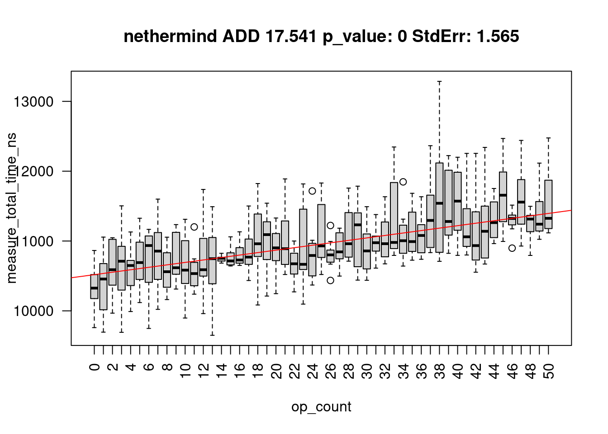

**Figure 1c: Execution time of DIV opcode**


**Figure 1d: Execution time of MULMOD opcode**

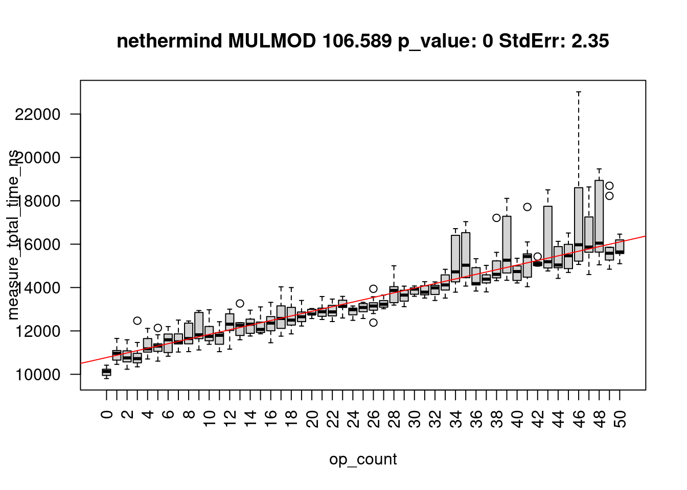

*Analysis* 

Nethermind general characteristics of benchmark follows what is expected. Rather small differences between OPCODEs times suggest there is rather large engine overhead. This could be removed from results, before making further gas cost estimations.

A repeatable pattern can be observed in jump OPCODEs:
**Figure 2: Execution times of JUMP opcodes**

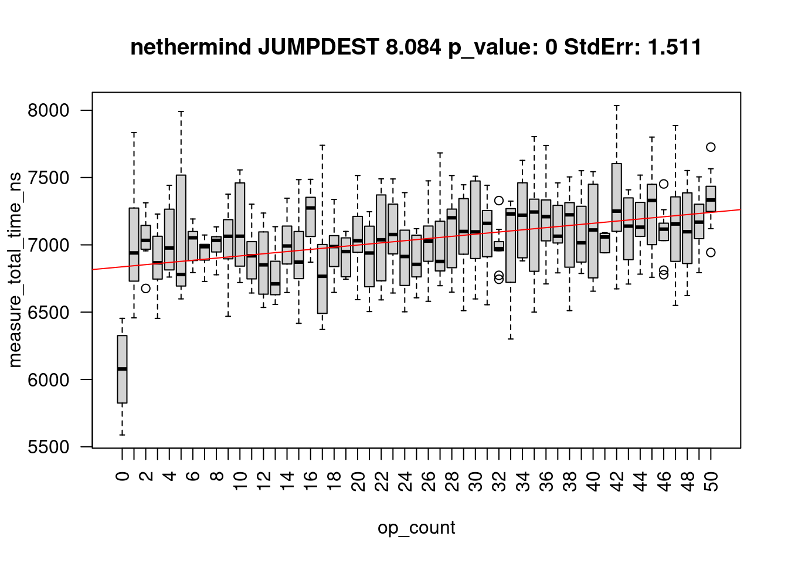
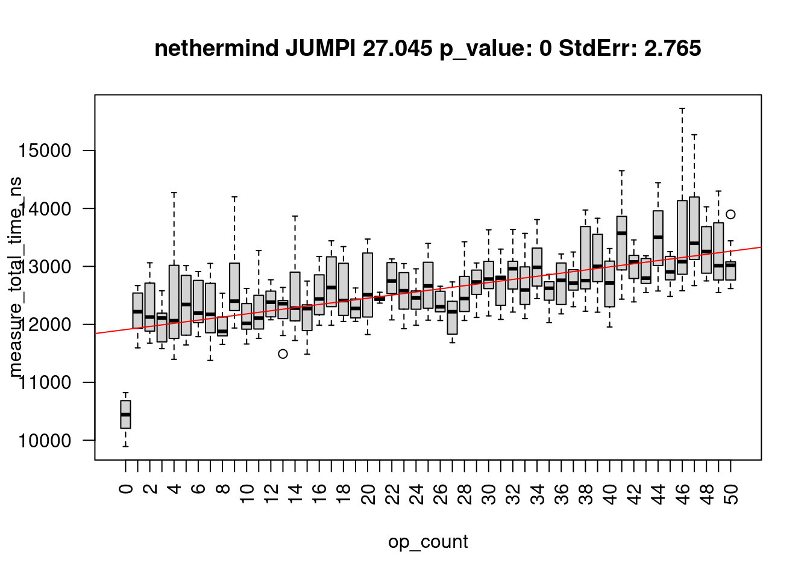

The first program with no JUMP instructions is significantly faster than the next one with one JUMP instruction. The follow-up programs behave in a normal linear fasion.
This might suggest that invoking a sinlge JUMP instruction initiates some engine functionality that is reused by any other JUMP instructions.


### EthereumJS

*Setup*

EtherumJS is written in TypeScript and executed in NodeJS environment. For benchmarks we use npm `benchmark` library. The EVM engine is contained in `@ethereumjs/evm` library. There is no concept of a host in EthereumJS, so we use a minimal implementation.

The benchmark code can be found at https://github.com/imapp-pl/ethereumjs-monorepo/tree/evm_gas_cost_stage_3.

The following script executes benchmarks:

```bash
    python3 ./src/instrumentation_measurement/measurements.py measure --mode benchmark --input_file ./local/pg_marginal_full5_c50_step1_shuffle.csv --evm ethereumjs --sample_size 10
```

*Results*

[Full details](./report_stage_iii_assets/ethereumjs_measure_marginal_single.html)

**Figure 3a: Execution time (`total_time_ns`) of all programs**


**Figure 3b: Execution time of ADD opcode**

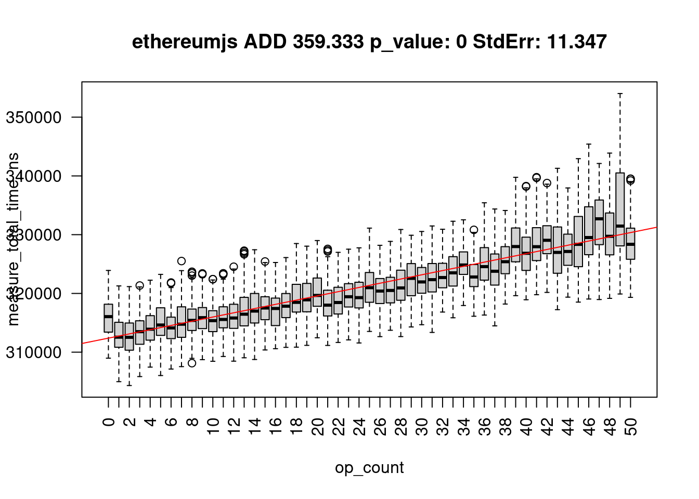

**Figure 3c: Execution time of DIV opcode**

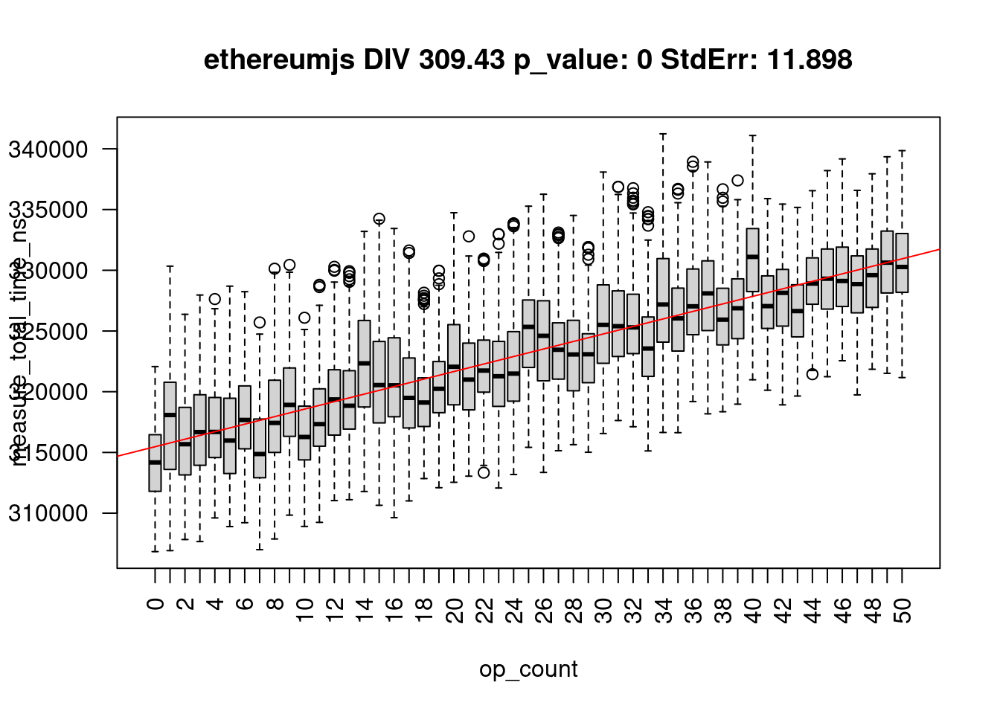

**Figure 3d: Execution time of MULMOD opcode**

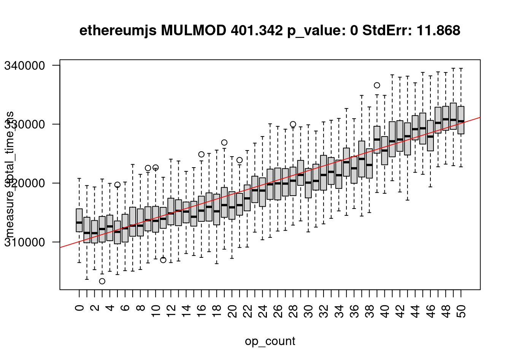

*Analysis* 

EthereumJS results are visibly slower that the rest and that's expected.
Most of the measured times are in the expected range. One specific to note is that PUSHx opcodes are not constant, but times increase linearly with the number of bytes pushed. The same cannot be observed for DUPx and SWAPx opcodes. This might suggest that EthereumJS has a special implementation for PUSHx opcodes.

### Erigon

*Setup*

Erigon share some of the code base with GoEthereum. We used GO's `testing` library for benchmarking, and the code can be found in `test/imapp_benchmark/imapp_bench.go`. We used in-memory database for a minimal impact with a minimal host.

The benchmark code can be found at https://github.com/imapp-pl/erigon/tree/imapp_benchmark

The following script executes benchmarks:
```
    python3 ./src/instrumentation_measurement/measurements.py measure --mode benchmark --input_file ./local/pg_marginal_full5_c50_step1_shuffle.csv --evm erigon --sample_size 10
```


*Results*

[Full details](./report_stage_iii_assets/erigon_measure_marginal_single.html)

**Figure 4a: Execution time (`total_time_ns`) of all programs**


**Figure 4b: Execution time of ADD opcode**

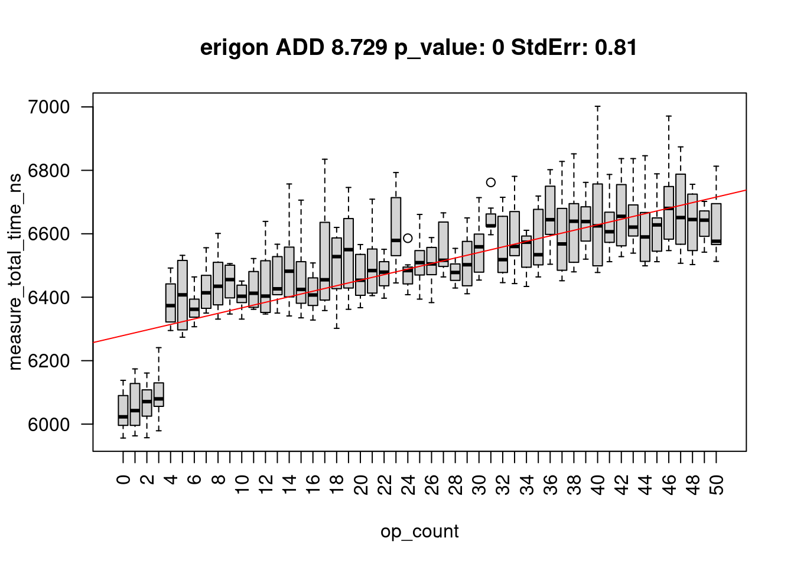

**Figure 4c: Execution time of DIV opcode**

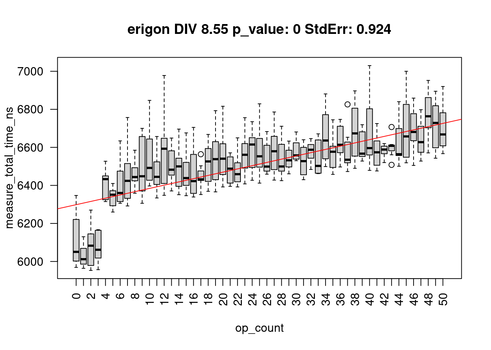

**Figure 4d: Execution time of MULMOD opcode**

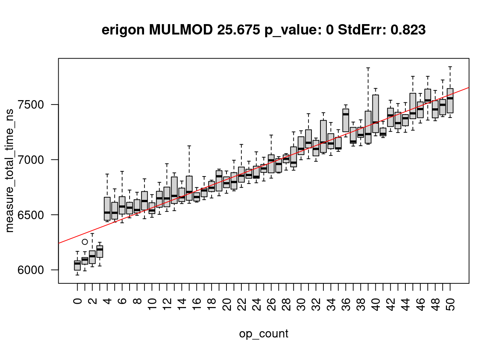


*Analysis* 

Erigon overall results follow the expected pattern. The engine overhead is rather small, which is expected from a Go implementation.

Again, PUSHx opcodes are not constant, but times increase linearly with the number of bytes pushed. The same cannot be observed for DUPx and SWAPx opcodes. This might suggest that Erigon has a special implementation for PUSHx opcodes.

When looking at individual OPCODEs, there is an interesing non-linear pattern in simple opcodes like ADD, DIV, MULMOD, etc. The first 3 executions are visibly faster that the following. The rest behave in more linear fashion. The reason for this is not clear.

### Besu

*Setup*

Besu is developed in Java. We used JMH library for benchmarking. The EVM engine is contained in `besu-vm` library. This implementation utilizes the concept of a `MessageFrame`, which acts as a host object too. 

The benchmark code an be found at https://github.com/imapp-pl/besu/tree/benchmarking.


*Results*

[Full details](./report_stage_iii_assets/besu_measure_marginal_single.html)

**Figure 5a: Execution time (`total_time_ns`) of all programs**


**Figure 5b: Execution time of ADD opcode**


**Figure 5c: Execution time of DIV opcode**

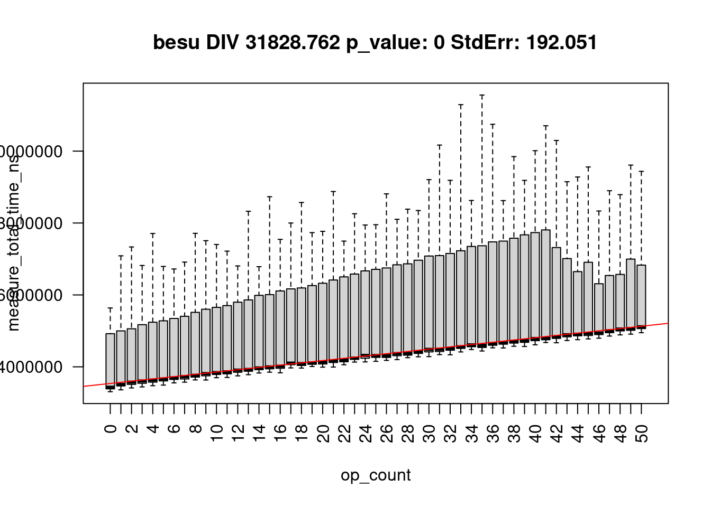

**Figure 5d: Execution time of MULMOD opcode**

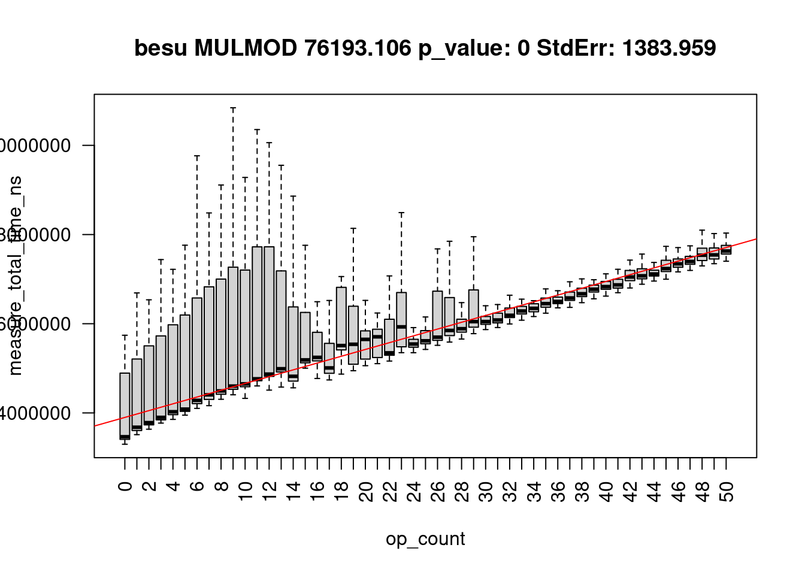


*Analysis* 

The timings for Besu are characterised by rather singificant scatter, even after removing outliers. This might be due to the JVM garbage collector, which is not controlled in our setup. Additionally the engine overhead is rather large. We tried to remove it from the results, but the results were not consistent.

As seen on the charts, the execution times for ADD, DIV and MULMOD are not consistent. While the majority behaves in linear fashion, there is a large portion that ofter takes longer. Again, we attribute it to the JVM garbage collector or other JVM internals.

### Rust EVM

*Setup*

Rust EVM is developed in Rust. We used `criterion` library for benchmarking. The EVM engine is contained in `revm` library. We used `DummyHost` as a host object for a minimal impact.

The benchmark code can be found at https://github.com/imapp-pl/revm/tree/evm_gas_cost_stage_3.


The following script executes benchmarks:
```
    python3 ./src/instrumentation_measurement/measurements.py measure --mode benchmark --input_file ./local/pg_marginal_full5_c50_step1_shuffle.csv --evm revm --sample_size 10
```

*Results*

[Full details](./report_stage_iii_assets/revm_measure_marginal_single.html)

**Figure 6a: Execution time (`total_time_ns`) of all programs**


**Figure 6b: Execution time of ADD opcode**

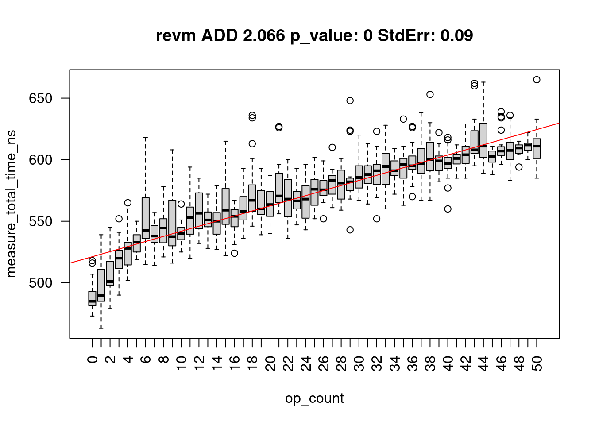

**Figure 6c: Execution time of DIV opcode**

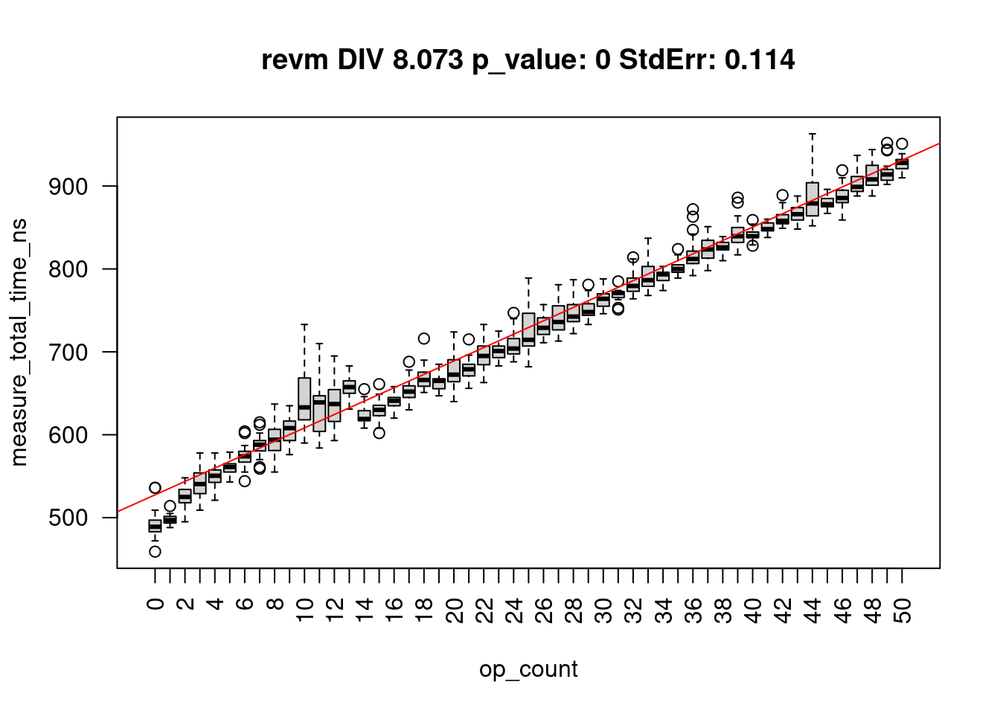

**Figure 6d: Execution time of MULMOD opcode**

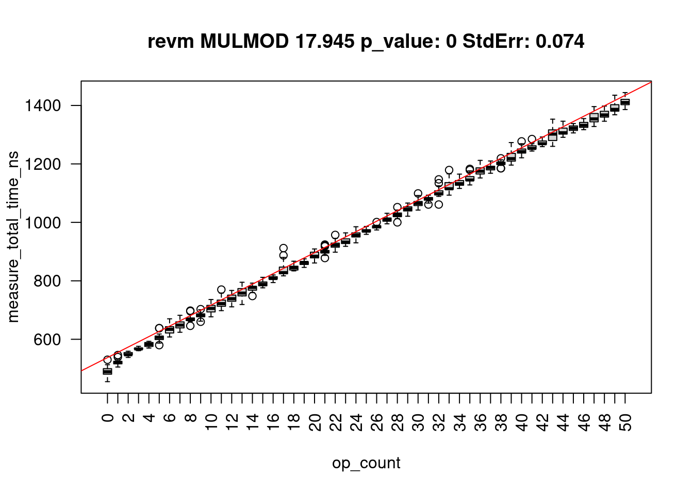

*Analysis* 

Rust EVM results are very consistent and follow the expected pattern. The engine overhead is rather small, which is expected from a Rust implementation.

In some opcodes like ADD, DIV and MULMOD there is a visible pattern of the first execution being slower than the rest. After running the specific opcode for a few times, the execution time stabilizes. This might be due to some caching or other Rust internals.

## Conclusions


