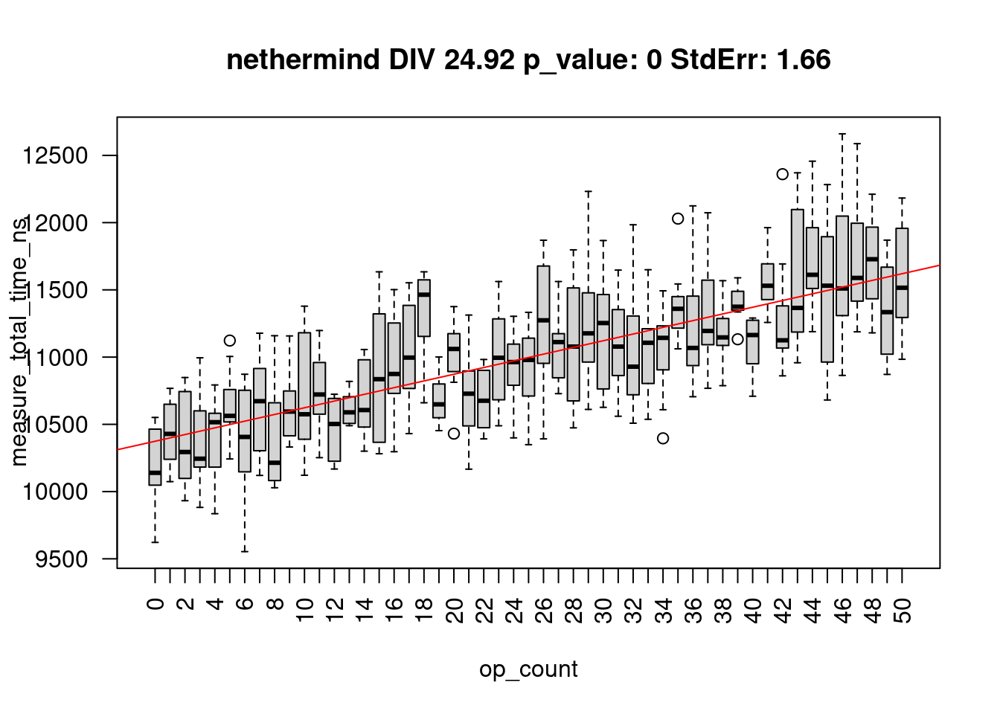
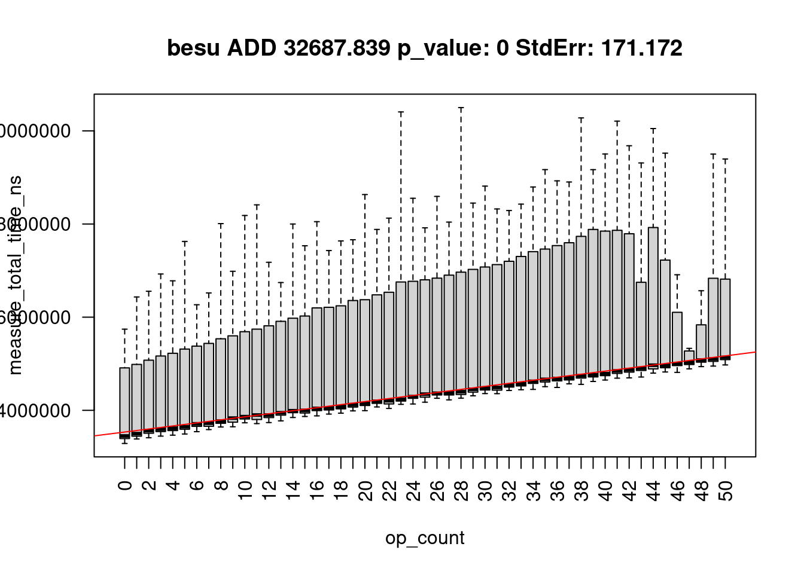

# Gas Cost Estimator
_Stage 3 Report_

## Abstract
We summarize the findings of the third stage of the "Gas Cost Estimator" research project. Based on the previous research, we provide a methodology for reproducible estimation of gas fees for OPCODEs as defined in the Ethereum Yellow Paper. This stage introduces measurements for five additional EVM implementations, compares it with the previous results and sets out a methodology for

## Introduction and project scope
This project is the continuation of the previous stages of Gas Cost Estimator. Please visit https://github.com/imapp-pl/gas-cost-estimator to find more information. After publishing our report from the second stage of the Gas Cost Estimator project we received feedback from the community. The community expressed the need to see other implementations being included in the research as well as to have the tooling automated and the benchmarks standardized. 

In this stage we apply the method of estimating gas costs of EVM OPCODEs suggested in our previous work to other EVM implementations:
- Nethermind (https://github.com/NethermindEth/nethermind)
- EthereumJS (https://github.com/ethereumjs/ethereumjs-monorepo)
- Erigon (https://github.com/ledgerwatch/erigon)
- Besu (https://github.com/hyperledger/besu)
- Rust EVM (revm) (https://github.com/bluealloy/revm)

Also we have improved the tooling so it is easier to reproduce the measurements. This work will be further continued in phase four, where we’ll deliver complete tooling, reproduction environment setup and measurements methods.

## Methodology
Our approach is to try and test each EVM implementation in isolation. That means that any host objects, storage access and other infrastructure elements are mocked. As a result, we had to exclude any OPCODEs that access storage. Also for consistency we have excluded any OPCODEs introduced after The Merge. 

Research and experiments in Stage II has shown the importance of removing uncontrollable and variable factors when estimating the cost of executing any given OPCODE. This includes:
- Caching on various levels, from processor to operating system to disk to EVM implementation
- Processor and hardware architecture
- Warm-up effect
- Operating System performance optimizations, pre-loading frameworks and libraries
- Operating System process priority and multithreading
- Garbage Collector impact
- Virtualization impact

While we appreciate the fact that these factors might influence the final cost of the OPCODE executions, their unpredictable nature means that it is not possible to accurately assess the impact. As a result, it is down to the network node operator to ensure that the optimal environment conditions are provided to the running node, or bear the additional cost.

In some cases node operators might intentionally provide sub-optimal environmental conditions, like running nodes on virtualized hardware, running multiple nodes on the same machine or running it on low spec machines. This might be due to business or infrastructure specifics. As long as node operators are aware of the increased costs, this is not an issue.

To eliminate the unwanted and unpredictable impacts of the factors above, and two make the results more comparable, we made two decisions:
1. Any execution times are measured on 'bare' EVM engines. That means that for any client node implementation, we look at the code directly responsible for the BYTECODE execution. This bypasses any infrastructure code that might already exist for a client. Also often implementations have a concept of a 'host' that provides the EVM engine with the external data, like accounts, code or storage. We mock those hosts or use minimal implementations where possible. 
2. For any given programming language we use the most popular benchmarking tool, rather than try to manually take timings. While implementations and solutions for benchmarking tools differ from language to language, we believe that using standardized, well tested and popular benchmarking frameworks gives the most trustworthy results.

Additional factor is what we call 'engine overhead'. This is the cost of time and resources incurred between receiving the BYTECODE by the engine and executing the first OPCODE. Some EVM implementations have minimal overhead required just to load the BYTECODE. While others use this opportunity to parse it, spin up the engine, pre-fetch required data and prepare any accounts required for execution. We are of the opinion that this cost is the true cost of the OPCODE execution and should be divided proportionally. This is done individually for each implementation. 

## EVM Implementations
In this chapter we show the measurement approach individual EVM implementation and then preset and analyze results 

### Nethermind

*Setup*

Nethermind is developed in .NET framework using C# language. The EVM engine is contained in `XXX` library. The host is minimal.
For benchmarking strategy we followed existing approach in the project with the following amendments

*Results*

[Full details](./report_stage_iii_assets/nethermind_measure_marginal_single.html)

**Figure 1a: Execution time (`total_time_ns`) of all programs**

**Figure 1b: Execution time of ADD opcode**

**Figure 1c: Execution time of DIV opcode**

**Figure 1d: Execution time of MULMOD opcode**

*Analysis* 

### EthereumJS

*Setup*

EtherumJS is written in TypeScript and executed in NodeJS environment. It proved particularly tricky to measure due to unstable results.

*Results*

[Full details](./report_stage_iii_assets/ethereumjs_measure_marginal_single.html)

**Figure 1a: Execution time (`total_time_ns`) of all programs**

**Figure 1b: Execution time of ADD opcode**

**Figure 1c: Execution time of DIV opcode**

**Figure 1d: Execution time of MULMOD opcode**

*Analysis* 

### Erigon

*Setup*

Erigon share some of the code base with GoEthereum. 

*Results*

[Full details](./report_stage_iii_assets/erigon_measure_marginal_single.html)

**Figure 1a: Execution time (`total_time_ns`) of all programs**

**Figure 1b: Execution time of ADD opcode**

**Figure 1c: Execution time of DIV opcode**

**Figure 1d: Execution time of MULMOD opcode**

*Analysis* 

### Besu

*Setup*

*Results*

[Full details](./report_stage_iii_assets/besu_measure_marginal_single.html)

**Figure 1a: Execution time (`total_time_ns`) of all programs**

**Figure 1b: Execution time of ADD opcode**

**Figure 1c: Execution time of DIV opcode**

**Figure 1d: Execution time of MULMOD opcode**

*Analysis* 

### Rust EVM

*Setup*

*Results*

[Full details](./report_stage_iii_assets/revm_measure_marginal_single.html)

**Figure 1a: Execution time (`total_time_ns`) of all programs**

**Figure 1b: Execution time of ADD opcode**

**Figure 1c: Execution time of DIV opcode**

**Figure 1d: Execution time of MULMOD opcode**

*Analysis* 

## Conclusions

