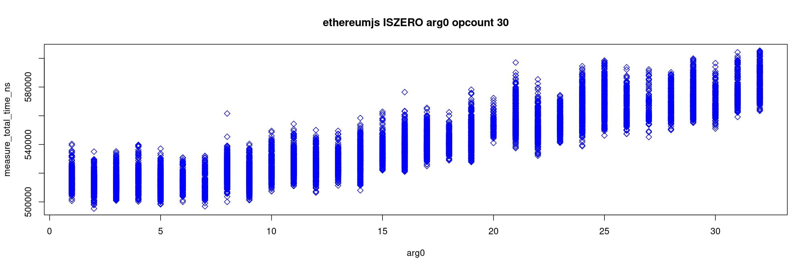

# Gas Cost Estimator
_Stage 3 Report_

## Abstract
We summarize the findings of the third stage of the "Gas Cost Estimator" research project. Based on the previous research, we provide a methodology for reproducible estimation of gas fees for OPCODEs as defined in the Ethereum Yellow Paper. This stage introduces measurements for five additional EVM implementations, compares them with the previous results and sets out a methodology for

## Introduction and project scope
This project is the continuation of the previous stages of the Gas Cost Estimator. Please visit https://github.com/imapp-pl/gas-cost-estimator to find more information. After publishing our report from the second stage of the Gas Cost Estimator project we received feedback from the community. The community expressed the need to see other implementations being included in the research as well as to have the tooling automated and the benchmarks standardized.

In this stage we apply the method of estimating gas costs of EVM OPCODEs suggested in our previous work to other EVM implementations:
- Nethermind (https://github.com/NethermindEth/nethermind)
- EthereumJS (https://github.com/ethereumjs/ethereumjs-monorepo)
- Erigon (https://github.com/ledgerwatch/erigon)
- Besu (https://github.com/hyperledger/besu)
- Rust EVM (revm) (https://github.com/bluealloy/revm)

Also, we have improved the tooling so it is easier to reproduce the measurements. This work will be further continued in phase four, where we’ll deliver complete tooling, reproduction environment setup and measurement methods.

## Methodology

### Measurement approach

Our approach is to test each EVM implementation in isolation. That means that any host objects, storage access and other infrastructure elements are mocked. As a result, we had to exclude any OPCODEs that access storage. Also for consistency, we have excluded any OPCODEs introduced after The Merge.

### Factors impacting the results

Research and experiments in Stage II have shown the importance of removing uncontrollable and variable factors when estimating the cost of executing any given OPCODE. This includes:
- Caching on various levels, from processor to operating system to disk to EVM implementation
- Processor and hardware architecture
- Warm-up effect
- Operating System performance optimizations, pre-loading frameworks and libraries
- Operating System process priority and multithreading
- Garbage Collector impact
- Virtualization impact
- Node synchronization and data model impact

While we appreciate the fact that these factors might influence the final cost of the OPCODE executions, their unpredictable nature means that it is not possible to accurately assess the impact. As a result, it is down to the network node operator to ensure that the optimal environment conditions are provided to the running node or bear the additional cost.

In some cases node operators might intentionally provide sub-optimal environmental conditions, like running nodes on virtualized hardware, running multiple nodes on the same machine or running it on low-spec machines. This might be due to business or infrastructure specifics. As long as node operators are aware of the increased costs, this is not an issue.

To eliminate the unwanted and unpredictable impacts of the factors above, and to make the results more comparable, we made two decisions:
1. Any execution times are measured on 'bare' EVM engines. That means that for any client node implementation, we look at the code directly responsible for the BYTECODE execution. This bypasses any infrastructure code that might already exist for a client. Also often implementations have a concept of a 'host' that provides the EVM engine with external data, like accounts, code or storage. We mock those hosts or use minimal implementations where possible.
2. For any given programming language we use the most popular benchmarking tool, rather than try to manually take timings. While implementations and solutions for benchmarking tools differ from language to language, we believe that using standardized, well-tested and popular benchmarking frameworks gives the most trustworthy results.

An additional factor is what we call 'engine overhead'. This is the cost of time and resources incurred between receiving the BYTECODE by the engine and executing the first OPCODE. Some EVM implementations have minimal overhead required just to load the BYTECODE. While others use this opportunity to parse it, spin up the engine, pre-fetch required data and prepare any accounts required for execution. We believe that this cost is the true cost of the OPCODE execution and should be divided proportionally. This is done individually for each implementation.

### Environment setup

For all the measurements we used a reference machine with the following specifications:
- Intel® Core™ i5-13500
- 64 GB DDR4
- 2 x 512 GB NVMe SSD
- Ubuntu 22.04

The required tooling can be installed using:
```bash
./src/setup_tools.sh
```

The individual EVM implementations are setup using:
```bash
./src/clone_clients.sh
./src/build_clients.sh
```

### Results interpretation

The results for each EVM are obtained using various setups and benchmarking tools. They do not express the cost of a single opcode execution directly. Thus results between different EVMs cannot be compared, for instance, `ADD` for geth cannot be compared with `ADD` for EthereumJS. But results within a given EVM can be compared, for instance, `ADD` with `MUL` for geth.

The calculated costs need to be scaled, to get to a common denominator, so an alternative gas cost schedule based on all EVMs can be proposed. The choice of scaling factors is the first methodological decision. We refer to the calculated costs for each EVM to the current gas cost schedule. The scale we are looking for is the solution to the following minimization problem: find the scale that the scaled calculated costs of all OPCODEs are the closest to the current gas cost schedule in the l2 norm (sqrt of the sum of squared differences). Note that the scales are set independently for EVMs. There are three remarks for l2 norm calculations:
- From PUSH1, …, PUSH32 only PUSH1 is taken into account. There are 32 PUSH opcodes so they would have excessive impact. The same for DUPs and SWAPs. Note that for some EVMs calculated costs for PUSH1, …, PUSH32 are noticeably different.
- The current gas cost schedule is taken as counterweights. So EXP and ADD have the same impact, for instance.
- The variability of argument size (`measure arguments`) has not been included in the gas schedule proposal

The resulting estimated costs (scaled calculated costs) can be compared now and an alternative gas cost schedule can be proposed. This is the second methodological decision. We simply take the average of scaled calculated costs with equal weight for each EVM. The resulting costs are assessed with two factors:
- The relative difference. You can consider it as the percentage difference between the current gas cost schedule and the alternative gas cost schedule. The greater the value is, the more an opcode is underpriced or overpriced.
- The relative standard deviation. This is the standard deviation of scaled calculated costs of a given opcode for all EVMs, but divided by the current gas cost of an opcode to get a relative value. Note that a low value means that the majority of EVMs yield very similar scaled estimated costs for an opcode and that is good because the alternative cost is more reliable.

As the final step, the alternative gas cost schedule is assessed as the whole system. When can it be considered as ‘good’? We informally say that ‘good’ means it is informative: delivers clear and effective guidelines on how to improve the gas cost schedule. First, low values of the relative standard deviations make the whole alternative gas cost schedule more reliable. Second, opcodes can be divided into those that have similar alternative and current gas cost and those that are clearly underpriced or overpriced. It seems to be very handy if most of the opcodes would fall into the first group.

### Alternatives
The following alternatives have been considered:
1. When scaling calculated costs to scaled calculated costs, the same scale could be used for all EVMs. This alternative has been rejected because it would blur the actual differences and make the alternative gas cost schedule less informative.
1. Do Not use scaling at all but compare calculated costs directly. This alternative has been rejected because the differences between EVMs are too big and the alternative gas cost schedule would be less informative.
1. Scale, but rather than using all OPCODEs in the l2 norm, use the selected ones. This is similar to the approach taken in Stage II. This alternative has been rejected because it is not possible to objectively decide what OPCODEs to use for scaling.
1. When building the alternative schedule all EVMs are given the same weight. This could be adjusted so the weights depend on:
    - popularity: more popular EVMs have more impact on the alternative gas cost schedule
    - performance: more performant EVMs have more impact on the alternative gas cost schedule

### Final remarks
- The alternative gas cost schedule can be scaled again to have a better match with the current gas cost schedule.
- The relative standard deviation effectively depends on how calculated costs are scaled. The system could be optimized towards minimising the number of opcodes with significant deviation. The method presented in this paper seemed to be more straightforward for the authors.


## EVM Implementations results
In this chapter, we show the measurement approach for individual EVM implementations and then preset and analyze the results.


### Nethermind

*Setup*

Nethermind is developed in the .NET framework using C# language. Our benchmark is based on the existing solution and uses `DotNetBenchmark` library. In `Nethermind.Benchmark.Bytecode` project we have added a new benchmark class `BytecodeBenchmark` that contains the benchmarking methods. This uses an in-memory database for a minimal impact. The EVM engine is contained in `Nethermind.Evm` library. The host is minimal.

The benchmark code can be found at https://github.com/imapp-pl/nethermind/tree/evm_gas_cost_stage_3.

The following script executes benchmarks:

```bash
	python3 ./src/instrumentation_measurement/measurements.py measure --mode benchmark --input_file ./local/pg_marginal_full5_c50_step1_shuffle.csv --evm nethermind --sample_size 10
```

*Results*

Full details:
- [Measure marginal](./report_stage_iii_assets/nethermind_measure_marginal_single.html)
- [Measure arguments](./report_stage_iii_assets/nethermind_measure_arguments_single.html)

Sample results:

**Figure 1a: Execution time (`total_time_ns`) of all programs in measure marginal mode**


**Figure 1b: Execution time of `EXP` opcode in measure arguments mode, 2nd argument variable length**


*Analysis*

Nethermind general characteristics of benchmark follow what is expected. Rather small differences between OPCODEs times suggest there is a rather large engine overhead. This could be removed from the results, before making further gas cost estimations.

A repeatable pattern can be observed in jump OPCODEs:
**Figure 2: Execution times of `JUMP` opcodes**


The first program with no `JUMP` instructions is significantly faster than the next one with one `JUMP` instruction. The follow-up programs behave in a normal linear fashion. The same is true for `JUMPDEST` and JUMPI opcodes.
This might suggest that invoking a single `JUMP` instruction initiates some engine functionality reused by any other `JUMP` instructions.
The EXP opcode is one of few that cost depends on the size of arguments. The other notable opcodes are `CALLDATACOPY`, `RETURNDATACCOPY`, and `CODECOPY`. In EXP case, there are two separate lines clearly visible. This indicates that the execution time, not only depends on argument size but also its value.


### EthereumJS

*Setup*

EtherumJS is written in TypeScript and executed in NodeJS environment. For benchmarks we use npm `benchmark` library. The EVM engine is contained in `@ethereumjs/evm` library. There is no concept of a host in EthereumJS, so we use a minimal implementation.

The benchmark code can be found at https://github.com/imapp-pl/ethereumjs-monorepo/tree/evm_gas_cost_stage_3.

The following script executes benchmarks:

```bash
	python3 ./src/instrumentation_measurement/measurements.py measure --mode benchmark --input_file ./local/pg_marginal_full5_c50_step1_shuffle.csv --evm ethereumjs --sample_size 10
```

*Results*

Full details:
- [Measure marginal](./report_stage_iii_assets/ethereumjs_measure_marginal_single.html)
- [Measure arguments](./report_stage_iii_assets/ethereumjs_measure_arguments_single.html)

Sample results:

**Figure 3a: Execution time (`total_time_ns`) of all programs**


**Figure 3b: Execution time of `EXP` opcode in measure arguments mode, 2nd argument variable length**


**Figure 3c: Execution time of `ISZERO` opcode in measure arguments mode, 1st argument variable length**



*Analysis*

EthereumJS results are visibly slower than the rest and that's expected, though most of the measured times are in the expected range. One specific thing to note is that `PUSHx` opcodes are not constant, but times increase linearly with the number of bytes pushed. The same cannot be observed for DUPx and SWAPx opcodes. This might suggest that EthereumJS has a special implementation for `PUSHx` opcodes.
On the argument side, the `EXP` opcode behaves as expected. The execution time increases linearly with the size of the second argument. Again the separation into two different lines shows that the execution time depends not only on the size of the argument but also its value. The `ISZERO` opcode behaves in a similar fashion, but the execution time increases linearly with the size of the first argument.

### Erigon

*Setup*

Erigon shares some of the code-base with GoEthereum. We used GO's `testing` library for benchmarking, and the code can be found in `test/imapp_benchmark/imapp_bench.go`. We used an in-memory database for a minimal impact with a minimal host.

The benchmark code can be found at https://github.com/imapp-pl/erigon/tree/imapp_benchmark

The following script executes benchmarks:
```
	python3 ./src/instrumentation_measurement/measurements.py measure --mode benchmark --input_file ./local/pg_marginal_full5_c50_step1_shuffle.csv --evm erigon --sample_size 10
```

*Results*

Full details:
- [Measure marginal](./report_stage_iii_assets/erigon_measure_marginal_single.html)
- [Measure arguments](./report_stage_iii_assets/erigon_measure_arguments_single.html)

Sample results:

**Figure 4a: Execution time (`total_time_ns`) of all programs**


**Figure 4b: Execution time of `EXP` opcode in measure arguments mode, 2nd argument variable length**


*Analysis*

Erigon's overall results follow the expected pattern. The engine overhead is rather small, which is expected from a Go implementation.

Again, `PUSHx` opcodes are not constant, but times increase linearly with the number of bytes pushed. The same cannot be observed for `DUPx` and `SWAPx` opcodes. This might suggest that Erigon has a special implementation for `PUSHx` opcodes.

When looking at individual OPCODEs, there is an interesting non-linear pattern in simple opcodes like `ADD`, `DIV`, `MULMOD`, etc. The first 3 executions are visibly faster than the following. The rest behave in a more linear fashion. The reason for this is not clear.

### Besu

*Setup*

Besu is developed in Java. We used JMH library for benchmarking. The EVM engine is contained in `besu-vm` library. This implementation utilizes the concept of a `MessageFrame`, which acts as a host object too.

The benchmark code can be found at https://github.com/imapp-pl/besu/tree/benchmarking.


*Results*

Full details:
- [Measure marginal](./report_stage_iii_assets/besu_measure_marginal_single.html)
- [Measure arguments](./report_stage_iii_assets/besu_measure_arguments_single.html)

Sample results:

**Figure 5a: Execution time (`total_time_ns`) of all programs**


**Figure 5b: Execution time of `EXP` opcode in measure arguments mode, 2nd argument variable length**


*Analysis*

The timings for Besu are characterised by a rather significant scatter, even after removing outliers. This might be due to the JVM garbage collector, which is not controlled in our setup. Additionally, the engine overhead is rather large. We tried to remove it from the results, but the results were not consistent.

As seen on the charts, the execution times for `ADD`, `DIV` and `MULMOD` are not consistent. While the majority behaves in a linear fashion, there is a large portion that often takes longer. Again, we attribute it to the JVM garbage collector or other JVM internals.

The execution time for `EXP` increases linearly with the size of the second argument. Again the separation into two different lines shows that the execution time depends not only on the size of the argument but also its value. In contrast to other implementations, the second line has a constant slope.

### Rust EVM

*Setup*

Rust EVM is developed in Rust. We used `criterion` library for benchmarking. The EVM engine is contained in `revm` library. We used `DummyHost` as a host object for a minimal impact.

The benchmark code can be found at https://github.com/imapp-pl/revm/tree/evm_gas_cost_stage_3.


The following script executes benchmarks:
```
	python3 ./src/instrumentation_measurement/measurements.py measure --mode benchmark --input_file ./local/pg_marginal_full5_c50_step1_shuffle.csv --evm revm --sample_size 10
```

*Results*

Full details:
- [Measure marginal](./report_stage_iii_assets/revm_measure_marginal_single.html)
- [Measure arguments](./report_stage_iii_assets/revm_measure_arguments_single.html)

Sample results:

**Figure 6a: Execution time (`total_time_ns`) of all programs**


**Figure 6b: Execution time of `EXP` opcode in measure arguments mode, 2nd argument variable length**


*Analysis*

Rust EVM results are very consistent and follow the expected pattern. The engine overhead is rather small, which is expected from a Rust implementation.

In some opcodes like `ADD`, `DIV` and `MULMOD` there is a visible pattern of the first execution being slower than the rest. After running the specific opcode for a few times, the execution time stabilizes. This might be due to some caching or other Rust internals.

This implementation does not have a separation of lines seen for the EXP arguments in other implementations.

## Conclusions


