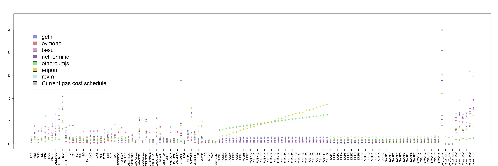

# Gas Cost Estimator
_Stage 3 Report_

## Abstract
We summarize the findings of the third stage of the "Gas Cost Estimator" research project. Based on the previous research, we provide a methodology for reproducible estimation of gas fees for OPCODEs as defined in the Ethereum Yellow Paper. This stage introduces measurements for five additional EVM implementations, compares them with the previous results and sets out a methodology for future measurements.

## Introduction and project scope
This project is the continuation of the previous stages of the Gas Cost Estimator. Please visit https://github.com/imapp-pl/gas-cost-estimator to find more information. After publishing our report from the second stage of the Gas Cost Estimator project we received feedback from the community. The community expressed the need to see other implementations being included in the research as well as to have the tooling automated and the benchmarks standardized.

In this stage we apply the method of estimating gas costs of EVM OPCODEs suggested in our previous work to other EVM implementations:
- Nethermind (https://github.com/NethermindEth/nethermind)
- EthereumJS (https://github.com/ethereumjs/ethereumjs-monorepo)
- Erigon (https://github.com/ledgerwatch/erigon)
- Besu (https://github.com/hyperledger/besu)
- Rust EVM (revm) (https://github.com/bluealloy/revm)

Also, we have improved the tooling so it is easier to reproduce the measurements. This work will be further continued in phase four, where we’ll deliver complete tooling, reproduction environment setup and measurement methods.

## Methodology

### Measurement approach

Our approach is to test each EVM implementation in isolation. That means that any host objects, storage access and other infrastructure elements are mocked. As a result, we had to exclude any OPCODEs that access storage. Also for consistency, we have excluded any OPCODEs introduced after The Merge.

### Factors impacting the results

Research and experiments in Stage II have shown the importance of removing uncontrollable and variable factors when estimating the cost of executing any given OPCODE. This includes:
- Caching on various levels, from processor to operating system to disk to EVM implementation
- Processor and hardware architecture
- Warm-up effect
- Operating System performance optimizations, pre-loading frameworks and libraries
- Operating System process priority and multithreading
- Garbage Collector impact
- Virtualization impact
- Node synchronization and data model impact

While we appreciate the fact that these factors might influence the final cost of the OPCODE executions, their unpredictable nature means that it is not possible to accurately assess the impact. As a result, it is down to the network node operator to ensure that the optimal environment conditions are provided to the running node or bear the additional cost.

In some cases node operators might intentionally provide sub-optimal environmental conditions, like running nodes on virtualized hardware, running multiple nodes on the same machine or running it on low-spec machines. This might be due to business or infrastructure specifics. As long as node operators are aware of the increased costs, this is not an issue.

To eliminate the unwanted and unpredictable impacts of the factors above, and to make the results more comparable, we made two decisions:
1. Any execution times are measured on 'bare' EVM engines. That means that for any client node implementation, we look at the code directly responsible for the BYTECODE execution. This bypasses any infrastructure code that might already exist for a client. Also often implementations have a concept of a 'host' that provides the EVM engine with external data, like accounts, code or storage. We mock those hosts or use minimal implementations where possible.
2. For any given programming language we use the most popular benchmarking tool, rather than try to manually take timings. While implementations and solutions for benchmarking tools differ from language to language, we believe that using standardized, well-tested and popular benchmarking frameworks gives the most trustworthy results.

An additional factor is what we call 'engine overhead'. This is the cost of time and resources incurred between receiving the BYTECODE by the engine and executing the first OPCODE. Some EVM implementations have minimal overhead required just to load the BYTECODE. While others use this opportunity to parse it, spin up the engine, pre-fetch required data and prepare any accounts required for execution. We believe that this cost is the true cost of the OPCODE execution and should be divided proportionally. This is done individually for each implementation.

### Environment setup

For all the measurements we used a reference machine with the following specifications:
- Intel® Core™ i5-13500
- 64 GB DDR4
- 2 x 512 GB NVMe SSD
- Ubuntu 22.04

The required tooling can be installed using:
```bash
./src/setup_tools.sh
```

The individual EVM implementations are setup using:
```bash
./src/clone_clients.sh
./src/build_clients.sh
```

### Results interpretation

The results for each EVM are obtained using various setups and benchmarking tools. They do not express the cost of a single opcode execution directly. Thus results between different EVMs cannot be compared, for instance, `ADD` for geth cannot be compared with `ADD` for EthereumJS. But results within a given EVM can be compared, for instance, `ADD` with `MUL` for geth.

The calculated costs need to be scaled, to get to a common denominator, so an alternative gas cost schedule based on all EVMs can be proposed. The choice of scaling factors is the first methodological decision. We refer to the calculated costs for each EVM to the current gas cost schedule. The scale we are looking for is the solution to the following minimization problem: find the scale that the scaled calculated costs of all OPCODEs are the closest to the current gas cost schedule in the l2 norm (sqrt of the sum of squared differences). Optimisation in l2 norm is similar to the lease squares method in regression analysis. Note that the scales are set independently for EVMs. There are three remarks for l2 norm calculations:
- From PUSH1, …, PUSH32 only PUSH1 is taken into account. There are 32 PUSH opcodes so they would have excessive impact. The same for DUPs and SWAPs. Note that for some EVMs calculated costs for PUSH1, …, PUSH32 are noticeably different.
- The current gas cost schedule is taken as counterweights. So EXP and ADD have the same impact, for instance.
- The variability of argument size (`measure arguments`) has not been included in the gas schedule proposal

The resulting estimated costs (scaled calculated costs) can be compared now and an alternative gas cost schedule can be proposed. This is the second methodological decision. We simply take the average of scaled calculated costs with equal weight for each EVM. The resulting costs are assessed with two factors:
- The relative difference. You can consider it as the percentage difference between the current gas cost schedule and the alternative gas cost schedule. The greater the value is, the more an opcode is underpriced or overpriced.
- The relative standard deviation. This is the standard deviation of scaled calculated costs of a given opcode for all EVMs but divided by the current gas cost of an opcode to get a relative value. Note that a low value means that the majority of EVMs yield very similar scaled estimated costs for an opcode and that is good because the alternative cost is more reliable.

As the final step, the alternative gas cost schedule is assessed as the whole system. When can it be considered as ‘good’? We informally say that ‘good’ means it is informative: delivers clear and effective guidelines on how to improve the gas cost schedule. First, low values of the relative standard deviations make the whole alternative gas cost schedule more reliable. Second, opcodes can be divided into those that have similar alternative and current gas costs and those that are clearly underpriced or overpriced. It seems to be very handy if most of the opcodes would fall into the first group.

As such, once created, the alternative gas cost schedule should be scaled again to fit better the current gas cost schedule. This would reduce the impact of the alternative gas cost schedule on the current gas cost schedule. To achieve this we select by expert knowledge OPCODEs that make the base for the scaling. We have chosen the following OPCODEs: arithmetic, bitwise and `PUSH1`.

### Alternatives
The following alternatives have been considered:
1. When scaling calculated costs to scaled calculated costs, the same scale could be used for all EVMs. This alternative has been rejected because it would blur the actual differences and make the alternative gas cost schedule less informative.
2. Do Not use scaling at all but compare calculated costs directly. This alternative has been rejected because the differences between EVMs are too big and the alternative gas cost schedule would be less informative.
3. Scale, but rather than using all OPCODEs in the l2 norm, use the selected ones. This is similar to the approach taken in Stage II. This alternative has been rejected because it is not possible to objectively decide what OPCODEs to use for scaling.
4. When building the alternative schedule all EVMs are given the same weight. This could be adjusted so the weights depend on:
    - popularity: more popular EVMs have more impact on the alternative gas cost schedule
    - performance: more performant EVMs have more impact on the alternative gas cost schedule
5. The relative standard deviation effectively depends on how calculated costs are scaled. The system could be optimized towards minimising the number of opcodes with significant deviation. The method presented in this paper seemed to be more straightforward for the authors.

## EVM Implementations results
In this chapter, we show the measurement approach for individual EVM implementations and then present and analyze the results.

For some EVMs, we observed interesting behaviours. Where possible, we left recommendations for the implementation teams. We believe that it would be very difficult to come to the same conclusions without the broad research presented in this report.

### Nethermind

#### Setup

Nethermind is developed in the .NET framework using C# language. Our benchmark is based on the existing solution and uses `DotNetBenchmark` library. In `Nethermind.Benchmark.Bytecode` project we have added a new benchmark class `BytecodeBenchmark` that contains the benchmarking methods. This uses an in-memory database for a minimal impact. The EVM engine is contained in `Nethermind.Evm` library. The host is minimal.

The benchmark code can be found at https://github.com/imapp-pl/nethermind/tree/evm_gas_cost_stage_3.

The following script executes benchmarks:

```bash
	python3 ./src/instrumentation_measurement/measurements.py measure --mode benchmark --input_file ./local/pg_marginal_full5_c50_step1_shuffle.csv --evm nethermind --sample_size 10
```

#### Results

Full details:
- [Measure marginal](./report_stage_iii_assets/nethermind_measure_marginal_single.html)
- [Measure arguments](./report_stage_iii_assets/nethermind_measure_arguments_single.html)

Sample results:

**Figure 1a: Execution time (`total_time_ns`) of all programs in measure marginal mode**

&nbsp;

**Figure 1b: Execution time of `EXP` opcode in measure arguments mode, 2nd argument variable length**

&nbsp;

#### Analysis

Nethermind’s general characteristics of benchmark follow what is expected. Rather small differences between OPCODEs times suggest there is a rather large engine overhead. This could be removed from the results, before making further gas cost estimations.

A repeatable pattern can be observed in jump OPCODEs:

**Figure 2: Execution times of `JUMP` opcodes**
&nbsp;

The first program with no `JUMP` instructions is significantly faster than the next one with one `JUMP` instruction. The follow-up programs behave in a normal linear fashion. The same is true for `JUMPDEST` and JUMPI opcodes.
This might suggest that invoking a single `JUMP` instruction initiates some engine functionality reused by any other `JUMP` instructions.
The EXP opcode is one of few that cost depends on the size of arguments. The other notable opcodes are `CALLDATACOPY`, `RETURNDATACCOPY`, and `CODECOPY`. In the EXP case, there are two separate lines clearly visible. This indicates that the execution time, not only depends on argument size but also its value.


### EthereumJS

#### Setup

EtherumJS is written in TypeScript and executed in NodeJS environment. For benchmarks we use npm `benchmark` library. The EVM engine is contained in `@ethereumjs/evm` library. There is no concept of a host in EthereumJS, so we use a minimal implementation.

The benchmark code can be found at https://github.com/imapp-pl/ethereumjs-monorepo/tree/evm_gas_cost_stage_3.

The following script executes benchmarks:

```bash
	python3 ./src/instrumentation_measurement/measurements.py measure --mode benchmark --input_file ./local/pg_marginal_full5_c50_step1_shuffle.csv --evm ethereumjs --sample_size 10
```

#### Results

Full details:
- [Measure marginal](./report_stage_iii_assets/ethereumjs_measure_marginal_single.html)
- [Measure arguments](./report_stage_iii_assets/ethereumjs_measure_arguments_single.html)

Sample results:

**Figure 3a: Execution time (`total_time_ns`) of all programs**

&nbsp;

**Figure 3b: Execution time of `EXP` opcode in measure arguments mode, 2nd argument variable length**

&nbsp;

**Figure 3c: Execution time of `ISZERO` opcode in measure arguments mode, 1st argument variable length**

&nbsp;

#### Analysis

EthereumJS results are visibly slower than the rest and that's expected, though most of the measured times are in the expected range. One specific thing to note is that `PUSHx` opcodes are not constant, but times increase linearly with the number of bytes pushed. The same cannot be observed for DUPx and SWAPx opcodes. This might suggest that EthereumJS has a special implementation for `PUSHx` opcodes.
On the argument side, the `EXP` opcode behaves as expected. The execution time increases linearly with the size of the second argument. Again the separation into two different lines shows that the execution time depends not only on the size of the argument but also its value. The `ISZERO` opcode behaves in a similar fashion, but the execution time increases linearly with the size of the first argument.

The `PUSHx` opcodes are not constant, but times increase linearly with the number of bytes pushed. The same cannot be observed for `DUPx` and `SWAPx` opcodes. Also, any other OPCODEs pushing to the stack behave better than a simple `PUSH1`. This may be related to the fact that `PUSHx` read from contract's bytecode.

#### Recommendation

Investigate the performance of the `PUSHx` OPCODEs.

### Erigon

#### Setup

Erigon shares some of the code base with GoEthereum. We used GO's `testing` library for benchmarking, and the code can be found in `test/imapp_benchmark/imapp_bench.go`. We used an in-memory database for a minimal impact with a minimal host.

The benchmark code can be found at https://github.com/imapp-pl/erigon/tree/imapp_benchmark

The following script executes benchmarks:
```
	python3 ./src/instrumentation_measurement/measurements.py measure --mode benchmark --input_file ./local/pg_marginal_full5_c50_step1_shuffle.csv --evm erigon --sample_size 10
```

#### Results

Full details:
- [Measure marginal](./report_stage_iii_assets/erigon_measure_marginal_single.html)
- [Measure arguments](./report_stage_iii_assets/erigon_measure_arguments_single.html)

Sample results:

**Figure 4a: Execution time (`total_time_ns`) of all programs**

&nbsp;

**Figure 4b: Execution time of `EXP` opcode in measure arguments mode, 2nd argument variable length**

&nbsp;

#### Analysis

Erigon's overall results follow the expected pattern. The engine overhead is rather small, which is expected from a Go implementation.

Again, `PUSHx` opcodes are not constant, but times increase linearly with the number of bytes pushed. The same cannot be observed for `DUPx` and `SWAPx` opcodes. This might suggest that Erigon has a special implementation for `PUSHx` opcodes.

When looking at individual OPCODEs, there is an interesting non-linear pattern in simple opcodes like `ADD`, `DIV`, `MULMOD`, etc. The first 3 executions are visibly faster than the following. The rest behave in a more linear fashion. The reason for this is not clear.

The `PUSHx` opcodes are not constant, but times increase linearly with the number of bytes pushed. The same cannot be observed for `DUPx` and `SWAPx` opcodes. This may be related to the fact that `PUSHx` read from contract's bytecode.

#### Recommendation

Investigate the performance of the `PUSHx` OPCODEs.


### Besu

#### Setup

Besu is developed in Java. We used JMH library for benchmarking. The EVM engine is contained in `besu-vm` library. This implementation utilizes the concept of a `MessageFrame`, which acts as a host object too.

The benchmark code can be found at https://github.com/imapp-pl/besu/tree/benchmarking.


#### Results

Full details:
- [Measure marginal](./report_stage_iii_assets/besu_measure_marginal_single.html)
- [Measure arguments](./report_stage_iii_assets/besu_measure_arguments_single.html)

Sample results:

**Figure 5a: Execution time (`total_time_ns`) of all programs**

&nbsp;

**Figure 5b: Execution time of `EXP` opcode in measure arguments mode, 2nd argument variable length**

&nbsp;

#### Analysis

The timings for Besu are characterised by a rather significant scatter, even after removing outliers. This might be due to the JVM garbage collector, which is not controlled in our setup. Additionally, the engine overhead is rather large. We tried to remove it from the results, but the results were not consistent.

As seen on the charts, the execution times for `ADD`, `DIV` and `MULMOD` are not consistent. While the majority behaves in a linear fashion, there is a large portion that often takes longer. Again, we attribute it to the JVM garbage collector or other JVM internals.

The execution time for `EXP` increases linearly with the size of the second argument. Again the separation into two different lines shows that the execution time depends not only on the size of the argument but also on its value. This indicates some form of optimization to cut executions times. In contrast to other implementations, the optimized path executes in O(1).

Some common OPCODEs perform worse than expected. Improving them would have a positive impact on the overall execution time. These are `LT`, `GT`, `AND`, `OR`, `XOR` and `BYTE`.

For the `LT`, `GT`, `AND`, `OR`, `XOR` and `BYTE` the execution times are higher than expected. This might indicate that there is a room for optimization.

The `SELFBALANCE` performance is significantly slower when compared to other implementations.

#### Recommendation

Investigate the performance of the `LT`, `GT`, `AND`, `OR`, `XOR`, `BYTE` and `SELFBALANCE` OPCODEs.

### Rust EVM

#### Setup

Rust EVM is developed in Rust. We used `criterion` library for benchmarking. The EVM engine is contained in `revm` library. We used `DummyHost` as a host object for a minimal impact.

The benchmark code can be found at https://github.com/imapp-pl/revm/tree/evm_gas_cost_stage_3.


The following script executes benchmarks:
```
	python3 ./src/instrumentation_measurement/measurements.py measure --mode benchmark --input_file ./local/pg_marginal_full5_c50_step1_shuffle.csv --evm revm --sample_size 10
```

#### Results

Full details:
- [Measure marginal](./report_stage_iii_assets/revm_measure_marginal_single.html)
- [Measure arguments](./report_stage_iii_assets/revm_measure_arguments_single.html)

Sample results:

**Figure 6a: Execution time (`total_time_ns`) of all programs**

&nbsp;

**Figure 6b: Execution time of `EXP` opcode in measure arguments mode, 2nd argument variable length**

&nbsp;

#### Analysis

Rust EVM results are very consistent and follow the expected pattern. The engine overhead is rather small, which is expected from a Rust implementation.

In some opcodes like `ADD`, `DIV` and `MULMOD` there is a visible pattern of the first execution being slower than the rest. After running the specific opcode a few times, the execution time stabilizes. This might be due to some caching or other Rust internals.

This implementation does not have a separation of lines seen for the EXP arguments in other implementations.

For the `BYTE`, `SHL`, `SHR` and `SAR` the execution times are higher than expected. This might indicate that there is a room for optimization.

#### Recommendation

Investigate the performance of the `BYTE`, `SHL`, `SHR` and `SAR` OPCODEs.

## Measurement Analysis

Full details:
- [Gas cost estimation analysis](./report_stage_iii_assets/final_estimation.html)
- [Alternative gas cost schedule](./report_stage_iii_assets/gas_schedule_comparison.csv)

The results for each EMV have been scaled and compared with the current gas cost schedule as per our methodology.


**Figure 7: Scaled calculated costs in comparison to the nominal gas schedule**

&nbsp;


Calculating the averages, we get the following alternative gas cost schedule:

**Figure 8: Alternative gas schedule**

&nbsp;


The raw results of the alternative gas cost schedule have been re-scaled to fit the current gas cost schedule. For this we have excluded OPCODEs with high client variability (like `EXP` or `SELFBALANCE`) and those visible inconsistency (like `PUSH2` to `PUSH32`). Instead we focused on the most common OPCODEs. Our analysis showed that the scale of 1.4 gives the best fit. This scale results in the least number of changes, for OPCODEs where it is worth the effort.

This table presents the full comparison between the current gas cost schedule and the final alternative gas cost schedule.

Opcode|Nominal Gas|Scaled Calculated Cost|Change %|Client Variability (Std Err %)
:----- | ----: | -----: | ----: | -----:
ADD|3|2.62|-12.79%|10.87%
MUL|5|5.30|6.08%|19.83%
SUB|3|3.30|9.98%|25.17%
DIV|5|4.73|-5.41%|23.02%
DIV expensive cost|5|11.29|125.74%|18.16%
SDIV|5|7.01|40.26%|29.03%
SDIV expensive cost|5|14.45|189.03%|20.26%
MOD|5|5.53|10.60%|20.38%
MOD expensive cost|5|12.16|143.18%|16.47%
SMOD|5|6.45|28.95%|22.25%
SMOD expensive cost|5|12.98|159.67%|17.34%
ADDMOD|8|7.80|-2.44%|24.75%
ADDMOD expensive_cost|8|18.93|136.59%|26.03%
MULMOD|8|12.09|51.13%|19.85%
MULMOD expensive_cost|8|23.01|187.65%|18.71%
EXP|10|19.41|94.07%|14.17%
EXP arg1 cost|50|30.58|-38.84%|20.94%
SIGNEXTEND|5|5.35|6.93%|21.60%
LT|3|3.94|31.17%|32.36%
GT|3|3.83|27.80%|33.50%
SLT|3|2.96|-1.48%|14.32%
SGT|3|2.94|-1.96%|14.19%
EQ|3|3.16|5.50%|26.02%
ISZERO|3|2.18|-27.25%|19.30%
AND|3|3.36|11.94%|27.09%
OR|3|3.38|12.64%|26.11%
XOR|3|3.40|13.19%|26.52%
NOT|3|2.51|-16.48%|18.57%
BYTE|3|4.19|39.70%|23.42%
SHL|3|4.36|45.20%|15.52%
SHR|3|4.46|48.54%|21.77%
SAR|3|5.30|76.61%|23.36%
ADDRESS|2|4.43|121.43%|23.87%
ORIGIN|2|3.83|91.54%|29.00%
CALLER|2|3.39|69.59%|22.15%
CALLVALUE|2|2.19|9.50%|19.41%
CALLDATALOAD|3|3.57|19.00%|16.10%
CALLDATASIZE|2|1.75|-12.68%|9.06%
CALLDATACOPY|2|9.45|372.68%|17.57%
CODESIZE|2|1.75|-12.25%|8.55%
CODECOPY|2|9.00|350.08%|16.38%
GASPRICE|2|2.63|31.64%|29.41%
RETURNDATASIZE|2|1.84|-7.77%|10.92%
RETURNDATACOPY|3|8.98|199.35%|24.00%
COINBASE|2|4.29|114.60%|28.14%
TIMESTAMP|2|2.22|10.79%|14.08%
NUMBER|2|2.23|11.62%|13.46%
DIFFICULTY|2|3.97|98.40%|32.81%
GASLIMIT|2|2.24|12.05%|12.87%
CHAINID|2|2.89|44.44%|27.41%
SELFBALANCE|5|11.22|124.31%|43.98%
POP|2|1.49|-25.56%|17.14%
MLOAD|3|5.51|83.60%|14.38%
MSTORE|3|10.81|260.28%|28.72%
MSTORE8|3|4.36|45.41%|18.98%
JUMP|8|2.84|-64.55%|30.75%
JUMPI|10|4.12|-58.79%|30.08%
PC|2|1.60|-20.13%|10.19%
MSIZE|2|1.72|-13.95%|9.76%
GAS|2|1.68|-15.99%|8.60%
JUMPDEST|1|1.25|25.43%|8.49%
PUSH1|3|2.86|-4.51%|34.68%
PUSH2|3|3.53|17.64%|30.48%
PUSH3|3|3.70|23.50%|29.64%
PUSH4|3|3.84|27.92%|30.05%
PUSH5|3|4.01|33.66%|31.82%
PUSH6|3|4.06|35.21%|33.10%
PUSH7|3|4.32|44.08%|33.31%
PUSH8|3|4.36|45.37%|35.37%
PUSH9|3|4.51|50.32%|35.79%
PUSH10|3|4.63|54.20%|36.83%
PUSH11|3|4.83|60.84%|36.19%
PUSH12|3|4.95|64.95%|37.52%
PUSH13|3|5.04|67.86%|37.88%
PUSH14|3|5.24|74.57%|38.22%
PUSH15|3|5.43|80.84%|37.79%
PUSH16|3|5.44|81.20%|38.89%
PUSH17|3|5.66|88.55%|39.35%
PUSH18|3|5.85|95.09%|39.87%
PUSH19|3|6.00|99.84%|39.74%
PUSH20|3|6.07|102.24%|41.48%
PUSH21|3|6.17|105.55%|42.24%
PUSH22|3|6.34|111.30%|42.33%
PUSH23|3|6.52|117.21%|42.26%
PUSH24|3|6.57|118.90%|43.29%
PUSH25|3|6.66|122.16%|43.43%
PUSH26|3|6.96|131.91%|43.82%
PUSH27|3|7.01|133.50%|44.21%
PUSH28|3|7.12|137.48%|44.33%
PUSH29|3|7.24|141.33%|45.69%
PUSH30|3|7.33|144.36%|46.09%
PUSH31|3|7.59|153.01%|45.58%
PUSH32|3|7.59|152.95%|47.23%
DUP1|3|1.81|-39.71%|17.04%
DUP2|3|1.78|-40.61%|19.33%
DUP3|3|1.73|-42.25%|18.21%
DUP4|3|1.71|-42.97%|18.88%
DUP5|3|1.70|-43.25%|19.64%
DUP6|3|1.78|-40.73%|19.07%
DUP7|3|1.61|-46.28%|14.61%
DUP8|3|1.59|-46.86%|14.48%
DUP9|3|1.77|-41.09%|18.24%
DUP10|3|1.69|-43.68%|17.61%
DUP11|3|1.60|-46.80%|15.86%
DUP12|3|1.78|-40.63%|16.66%
DUP13|3|1.63|-45.65%|15.49%
DUP14|3|1.63|-45.56%|14.09%
DUP15|3|1.81|-39.59%|17.36%
DUP16|3|1.62|-45.85%|14.24%
SWAP1|3|2.03|-32.33%|15.97%
SWAP2|3|2.06|-31.29%|14.43%
SWAP3|3|2.06|-31.50%|14.16%
SWAP4|3|2.04|-31.98%|14.78%
SWAP5|3|2.01|-32.85%|16.43%
SWAP6|3|2.11|-29.70%|16.35%
SWAP7|3|2.25|-24.87%|17.06%
SWAP8|3|2.03|-32.24%|14.60%
SWAP9|3|2.01|-32.99%|16.21%
SWAP10|3|2.37|-21.06%|19.15%
SWAP11|3|1.99|-33.59%|15.01%
SWAP12|3|2.12|-29.19%|15.98%
SWAP13|3|2.13|-29.03%|16.78%
SWAP14|3|1.97|-34.46%|15.40%
SWAP15|3|2.38|-20.72%|21.62%
SWAP16|3|2.29|-23.70%|19.30%


> **Remarks**
>
> The data clearly shows that some changes can be made to the current gas proposal. Still, any such changes should be carefully considered, as there are other factors not taken into account in this research: ease of implementation, backward compatibility, hard fork requirement, existing tooling, hardcoded values in auxiliary software, etc.
>
>The alternative gas cost schedule is a proposal and should be treated as such. We believe that the methodology presented in this report is a good starting point for further research and discussion.


### EXP
Notice that `EXP` opcode execution cost is expressed with the formula: the base cost (currently 10) and a dynamic cost for each byte of an exponent (currently 50 for each byte). For the detailed analysis of the `EXP` opcode, we have used the following data:
- [EvmOne](./report_stage_iii_assets/evmone_measure_arguments_single_exp.html)
- [Geth](./report_stage_iii_assets/geth_measure_arguments_single_exp.html)
- [Netehrmind](./report_stage_iii_assets/nethermind_measure_arguments_single_exp.html)
- [EtherumJS](./report_stage_iii_assets/ethereumjs_measure_arguments_single_exp.html)
- [Erigon](./report_stage_iii_assets/erigon_measure_arguments_single_exp.html)
- [Besu](./report_stage_iii_assets/besu_measure_arguments_single_exp.html)
- [Rust EVM](./report_stage_iii_assets/revm_measure_arguments_single_exp.html)

Please see 'EXP' section in the corresponding files.

The `EXP` opcode proved quite difficult to estimate due to high client variability. Additionally, the measure marginal method was not able to sufficiently estimate the base cost of the opcode. The `EXP` measure marginal method used the argument size of 1 byte, as this provided the most consistent results. With the measure argument method, the linear regresion placed some of the base `EXP` costs below zero. This values were disregarded in the further calculations.

For a more accurate estimation, we compare EXP base and dynamic estimates to the execution of `ADD` and `MUL` opcodes. These opcodes are used as a reference as they are the most basic arithmetic ones. Given this data we can estimate the cost of the single byte exponentiation as follows:

```math
	exp_byte_cost = exp_byte_time / (add_time + mul_time) * (add_cost + mul_cost)
```

With this formula we can further estimate the base cost of the `EXP` opcode, by subtracting the cost of the arguments from the total cost of `EXP`.

The following table shows the results*:

Client|ADD ns|MUL ns|EXP per byte ns|EXP per byte gas| EXP base ns | EXP base gas
:----- | ----: | -----: | ----: | -----: | -----: | -----:
EvmOne|18.30|30.34|214.25|35.23|15.35|0
Geth|19.78|28.21|98.74|16.46|82.88|0
Netehrmind|31.44|61.78|274.48|23.55|870.21|51.12
EtherumJS|290|381|1590|18.96|4623|36.16
Erigon|6.68|7.81|84.63|46.72|0|0
Besu|58815|75348|154635|9.22|415094|15.53
Rust EVM|2.86|3.59|35.13|43.57|15.38|0

* Again, the execution times are not directly comparable between clients, as they have different setup, e.g. Besu's internal loop of ~10k times.

## Recommendations

### Proposed gas cost schedule
After fitting the alternative gas cost schedule to the current gas cost schedule, we looked at the second parameter: client variability. It only makes sense to propose a change if the client consistently shows a different result. OPCODEs with high client variability were removed as the results were deemed too diversified to be reliable. The following table shows the results:

Opcode|Nominal Gas Cost|Proposed Gas Cost|Notes
:----- | ----: | -----: | :----
EXP|10|10|See notes below
ISZERO|3|2|
SHL|3|5|
SHR|3|5|
SAR|3|5|
MULMOD|8|10|
ADDRESS|2|3|See notes below
ORIGIN|2|3|See notes below
CALLER|2|3|See notes below
CALLDATACOPY|2|8|
CODECOPY|2|8|
RETURNDATACOPY|3|8|
COINBASE|2|3|See notes below
CHAINID|2|3|See notes below
SELFBALANCE|5|10|See notes below
MLOAD|3|5|
MSTORE|3|10|
MSTORE8|3|5|
JUMP|8|3|
JUMPI|10|3|

### Opcode specific recommendations

#### `SDIV` and `SMOD`
Both opcodes show a slight sensibility to the size of the first argument, the numerator. This dependence is not enough to introduce the dynamic element of the gas cost.

**Recommendation**: Keep the gas cost as is. Revisit in the future.

#### `MULMOD`
This opcode is not sensitive to the size of the arguments. Still, the actual gas cost is higher than the current 8.

**Recommendation**: Increase the gas cost to 10.

#### `EXP`
The current gas is calculated as follows:
```
static gas = 10
dynamic gas = 50 * exponent byte size
```
As there is no unequivocal consensus on the base cost of the `EXP` opcode, we recommend keeping it as is. However, for the dynamic part, there is a clear consensus that the current gas cost is too high.

**Recommendation**: Change the formula to:
```
static gas = 10
dynamic gas = 25 * exponent byte size
```

#### Transaction context
Several OPCODEs push to the stack data from the transaction context. These are `ADDRESS`, `ORIGIN`, `CALLER`, `COINBASE`, `CHAINID`. The current gas cost is 2 for all of them. In theory, it makes sense as the context is already available to the EVM and it is just a matter of pushing it to the stack. Moreover, the data is never longer than 20 bytes.

Similarly, the `SELFBALANCE` OPCODE pushes the balance of the executing account to the stack. The account must have been retrieved before the execution, so it is safe to assume that the balance is already available to the EVM and it is just a matter of pushing it to the stack. The current gas cost is 5.

Still, our analysis shows that the real gas cost is consistently higher.

**Recommendation**: In the short term, the gas cost of these OPCODEs should be increased as per the table above. But in our opinion the original estimation of the gas cost is correct and EVM implementation teams should investigate why the real gas cost is higher. This should be revisited in the future.

#### Memory Copy, Store and Load OPCODEs
Three OPCODEs copy data into memory: `CALLDATACOPY`, `CODECOPY` and `RETURNDATACOPY`. Our analysis shows that the measured gas cost is consistently higher than the current gas cost. Additionally the real-life cost of `CODECOPY` might be even higher as it depends on the context, which was outside of the scope of our measurements.

Similarly, there are three memory-operations OPCODEs: `MLOAD`, `MSTORE` and `MSTORE8`. As above, the real gas cost is consistently higher than the current gas cost.

This indicates that the memory management for all EVMs is consistently more expensive than expected.

**Recommendation**: Increase the gas cost of these OPCODEs as per the table above. In the long term, the EVM implementation teams should investigate why the real gas cost is higher. This should be revisited in the future.

#### Jump OPCODEs
There are two jump OPCODEs: `JUMP` and `JUMPI`. Our analysis shows that the real gas cost is consistently lower than the current gas cost.

This suggests that the cost could be lowered. But with the introduction of new relative jumps and disallowing dynamic jumps (EIP-4750 and EIP-4200), these OPCODEs might become irrelevant.

**Recommendation**: Assess when EIP-4750 and EIP-4200 are to be implemented. If it is likely to happen in a distant future, lower the gas cost of these OPCODEs as per the table above.
