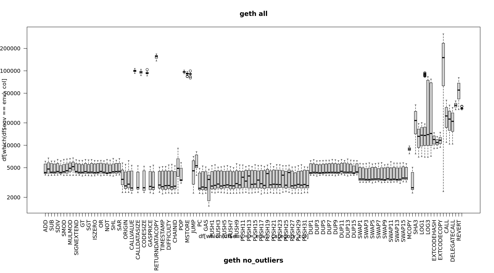
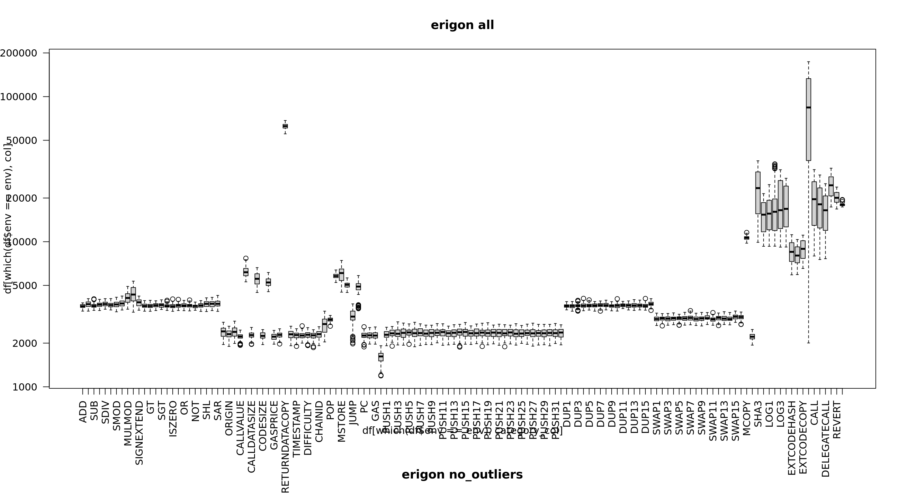
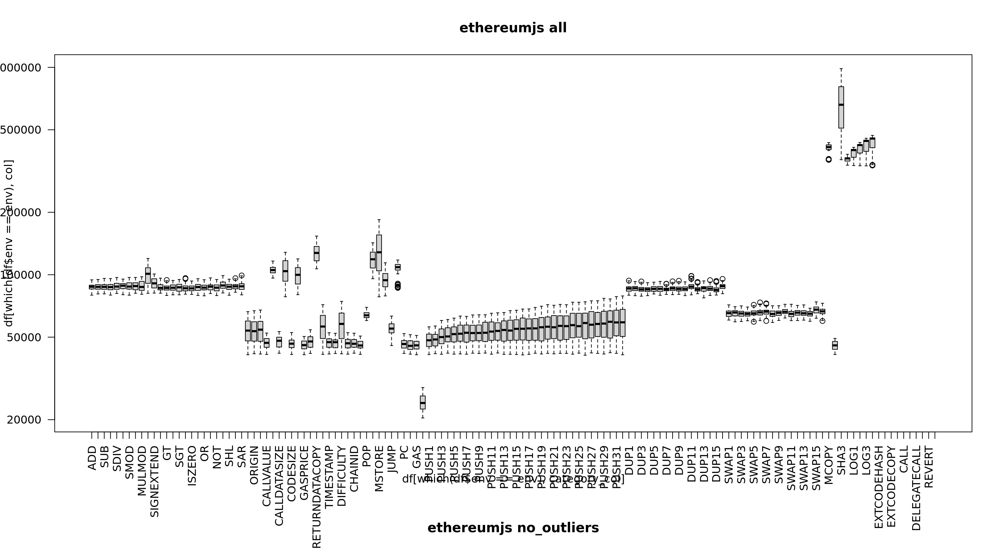
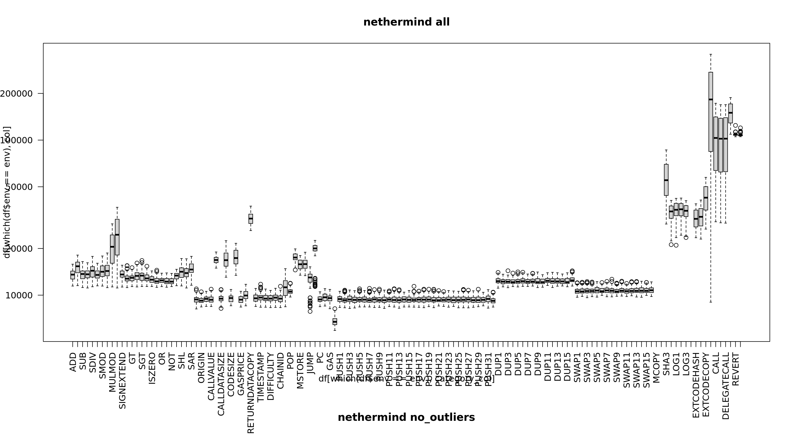
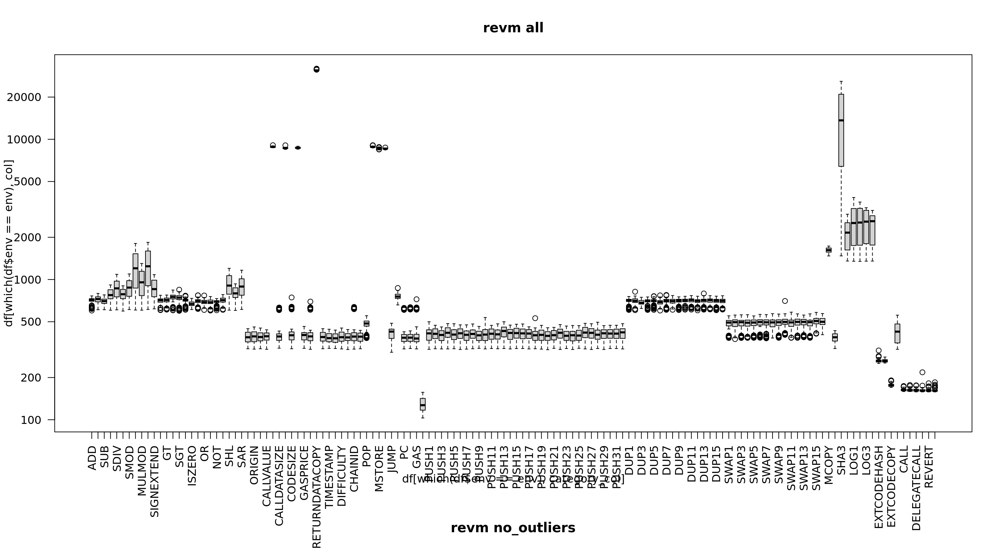

# Gas Cost Estimator
_Stage 4 Report_

> **_NOTE:_**  This document is work in progress. The * denotes incomplete parts.

## Abstract
In this stage we use the findings from the previous stages and apply them to produce comprehensive analysis of the gas cost. The improved methodology incorporate standardized benchmarks, data analysis and report generation. The scope has been extended to all OPCODEs, precompiles and top 7 EVM implemnetations. The reproducibility of the results has been improved by providing a complete setup guide and tooling. Additionally the release contains precompiled binaries for even easier execution. The result of this stage is a proposal of a new Gas Cost Scheduled to be included in the next hard fork.

## Introduction and project scope
This project is the continuation of the previous stages of the Gas Cost Estimator. Please visit https://github.com/imapp-pl/gas-cost-estimator to find more information. After publishing our report from the second and third stages of the Gas Cost Estimator project we received feedback from the community. The community expressed the need to see other implementations being included in the research as well as to have the tooling automated and the benchmarks standardized.

### EVM Implementaions
The following EVM implementations have been included in the research:
- [EvmOne *](https://github.com/imapp-pl/evmone), version 0.12.0, commit [bf6c91d](https://github.com/ethereum/evmone/commit/bf6c91df5a0e0ad9de525eca8e9d8286c8ec5ab1)
- [Go Ethereum](https://github.com/ethereum/go-ethereum), version  Rayingri (v1.14.8)
, commit [a9523b6](https://github.com/ethereum/go-ethereum/commit/a9523b6428238a762e1a1e55e46ead47630c3a23)
- [Erigon](https://github.com/erigontech/erigon), version 2.60.6, commit [d24e5d4](https://github.com/erigontech/erigon/commit/d24e5d45755d7b23075c507ad9216e1d60ad03de)
- [EthereumJS](https://github.com/imapp-pl/ethereumjs-monorepo), version 8.1.0, commit [db8c0db](https://github.com/imapp-pl/ethereumjs-monorepo/commit/db8c0dbe76b366edae7b609960bd99ff00e10cf7)
- [Nethermind](https://github.com/imapp-pl/nethermind), version 1.28.0, commit [e65c1cd](https://github.com/imapp-pl/nethermind/commit/e65c1cd59d858e3add8203d1bc21ec1c1f38de5b)
- [Revm](https://github.com/imapp-pl/revm), version 13.0.0, commit [d82c762](https://github.com/imapp-pl/revm/commit/d82c7621d7256d8067e97845411c68a3e1d6ef57)
- [Besu *](https://github.com/imapp-pl/besu)

### Measured OPCODEs and precompiles
In this stage we finally measure all* OPCODEs together with the precompiles.

### Tooling and automation *
The reproducibility is the key to the research. We have provided a complete setup guide and tooling to make the execution of the benchmarks as easy as possible. There are two ways to perform the measurements in your environment. The first one is to use the provided scripts to build the EVM implementations and run the benchmarks. The second one is to use the provided release with precompiled binaries. The binaries are available for Linux x64, MacOS x64 and Windows.

## Methodology

### Measurement approach
Our approach is to test each EVM implementation in isolation. That means that any host objects, storage access and other infrastructure elements are either mocked, or a minimal implementation is used. This allows us to measure the execution time of the OPCODEs directly, without any additional overhead.

For all EVM implementations, we have created a benchmarking code that executes the OPCODEs in a controlled environment. We used standard benchmarking libraries for each language and framework.

### Factors impacting the results
Research and experiments previous stages have shown the importance of removing uncontrollable and variable factors when estimating the cost of executing any given OPCODE. This includes:
- Caching on various levels, from processor to operating system to disk to EVM implementation
- Processor and hardware architecture
- Warm-up effect
- Operating System performance optimizations, pre-loading frameworks and libraries
- Operating System process priority and multithreading
- Garbage Collector impact
- Virtualization impact
- Node synchronization and data model impact

The benchmark approach used for the measurement sufficiently mitigates the impact of these factors. The benchmarking code is designed to be as simple as possible, with minimal dependencies. The benchmarking code is executed in a controlled environment, with no other processes running. The benchmarking code is executed multiple times to ensure that the results are consistent.

### Environment setup
For all the measurements we used a reference machine with the following specifications:
- Intel® Core™ i5-13500
- 64 GB DDR4
- 2 x 512 GB NVMe SSD
- Ubuntu 22.04

The provided Python script makes it easy to run the benchmarks and collect the results:

```bash
python3 ./src/instrumentation_measurement/measurements.py measure --input_file ./src/stage4/pg_marginal_full5_c50_step5_shuffle.csv --evm evm_name --sample_size 10
```

Where `evm_name` is the name of the EVM implementation you want to measure.

## EVM Implementations Details
In this chapter, we describe the benchmarking approach for individual EVM implementations.

### EvmOne *
EvmOne is a reference EVM implementation written in C++. We used Google Benchmark library for benchmarking.

### Go Ethereum
Go Ethereum is the most popular EVM implementaion. It is written in Go. For our measurements we expanded the `cmd/evm` tool available in Geth. It uses Go's `testing` library for benchmarking. We used an in-memory database for a minimal impact with a minimal host.

### Erigon
Erigon is another EVM implementation written in Go. It has a similar `evm` tool as Go Ethereum that was harnessed for the benchmarks.

### EthereumJS
EtherumJS is written in TypeScript and executed in NodeJS environment. No existing tool was available for benchmarking, so we created a new one. The code is available in [https://github.com/imapp-pl/ethereumjs-monorepo/blob/benchmark-bytecode-execution/packages/vm/benchmarks/bytecode.ts](). It uses `tinybench` library for benchmarking. The EVM engine is contained in `@ethereumjs/evm` library. The state is cleared on every benchmark run.

### Nethermind
Nethermind is developed in the .NET framework using C# language. The existing benchmark did not satisfy our requirements, so we created a new one. The source code is available at [https://github.com/imapp-pl/nethermind/blob/benchmark-bytecode-execution/src/Nethermind/Nethermind.Benchmark.Runner/BytecodeBenchmark.cs](). The improvements include:
- bytecode provided as a command-line parameter
- setup and teardown methods for each benchmark that do not affect the measurement
- exception handling

### Revm
Revm is developed in Rust. The existing `revme` tool did not satisfy our requirements, so we extended it. The source code is available at [https://github.com/imapp-pl/revm/blob/benchmark-bytecode-execution/bins/revme/src/cmd/evmrunner.rs](). The improvements include:
- use `criterion` rather than `microbench` for the benchmarking libary, which provides more stable results
- bytecode provided as a command-line parameter
- setup and teardown methods for each benchmark that do not affect the measurement

### Besu *
Besu is developed in Java. 

## Measurement Analysis

The full list of bytecode instructions used for the measurements is available in the [pg_marginal_full5_c50_step5_shuffle.csv](src/stage4/pg_marginal_full5_c50_step5_shuffle.csv) file.

The full results of the measurements are available in the [stage4](src/stage4) directory.
### OPCODEs Details *

**Figure: Go Ethereum all OPCODEs**

&nbsp;

**Figure: Erigon all OPCODEs**

&nbsp;

**Figure: EthereumJS all OPCODEs**

&nbsp;

**Figure: Nethermind all OPCODEs**

&nbsp;

**Figure: Revm all OPCODEs**

&nbsp;


### Precompiles Details *

### Summary *

## Tooling and Automation *

### Release *

### Setup Guide *

## Recommendations *

### EVM Implementations Recommendations *

### Proposed gas cost schedule *
