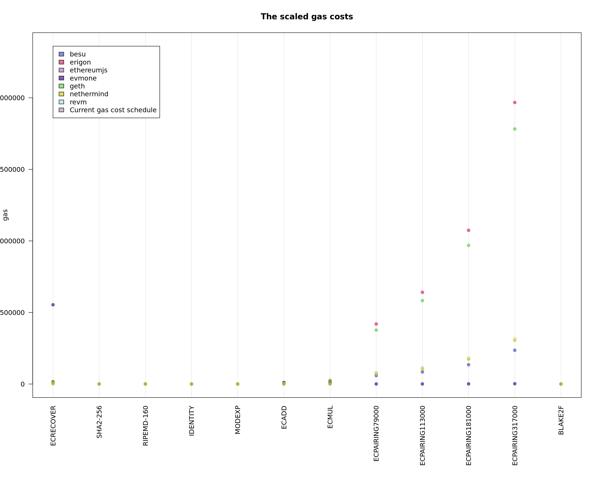

# Gas Cost Estimator
_Stage 4 Report_

> **_NOTE:_** This document is a work in progress. The * denotes incomplete parts.

## Abstract
In this stage, we use the findings from the previous stages and apply them to produce a comprehensive analysis of the gas cost. The improved methodology incorporates standardized benchmarks, data analysis, and report generation. The scope has been extended to all OPCODEs, precompiles, and 7 popular EVM implementations with different technological stacks and architectures. The reproducibility of the results has been improved by providing a complete setup guide and tooling. Cooperation with the EVM implementers and the broader community allowed us to create benchmark tools with similar functionality for all EVM implementations. Where possible, our benchmarks are integrated into the EVM implementations' code base. This future-proofs the research and gives more confidence in the results. Additionally, the release package contains precompiled binaries for even easier execution. The result of this stage is a new Gas Cost Schedule to be proposed for the next hard fork.

## Introduction and project scope
This project continues the previous stages of the Gas Cost Estimator. Please visit https://github.com/imapp-pl/gas-cost-estimator to find more information. After publishing our report from the second and third stages of the Gas Cost Estimator project, we received feedback from the community. The community expressed the need to see other implementations being included in the research as well as to have the tooling automated and the benchmarks standardized.

### EVM Implementations
The following EVM implementations have been included in the research:
- [EvmOne](https://github.com/JacekGlen/evmone), version 0.13.0, commit [492e513](https://github.com/JacekGlen/evmone/commit/492e513a7d1cd905c6c45cf17d830fc8dc13288b)
- [Go Ethereum](https://github.com/ethereum/go-ethereum), version Rayingri (v1.14.12), commit [a9523b6](https://github.com/ethereum/go-ethereum/commit/a9523b6428238a762e1a1e55e46ead47630c3a23)
- [Erigon](https://github.com/erigontech/erigon), version 2.60.10, commit [d24e5d4](https://github.com/erigontech/erigon/commit/d24e5d45755d7b23075c507ad9216e1d60ad03de)
- [EthereumJS](https://github.com/imapp-pl/ethereumjs-monorepo), version 8.1.1, commit [db8c0db](https://github.com/imapp-pl/ethereumjs-monorepo/commit/db8c0dbe76b366edae7b609960bd99ff00e10cf7)
- [Nethermind](https://github.com/imapp-pl/nethermind), version 1.29.1, commit [e65c1cd](https://github.com/imapp-pl/nethermind/commit/e65c1cd59d858e3add8203d1bc21ec1c1f38de5b)
- [Revm](https://github.com/imapp-pl/revm), version 18.0.0, commit [d82c762](https://github.com/imapp-pl/revm/commit/d82c7621d7256d8067e97845411c68a3e1d6ef57)
- [Besu](https://github.com/lukasz-glen/besu), version 24.10.0, commit [d061dfa](https://github.com/lukasz-glen/besu/commit/d061dfa0d574fe2d4b4be4b0e61b8d11ce1501ee)

### Measured OPCODEs and precompiles
In this stage, we measure all OPCODEs together with the precompiles.

### Tooling and automation
Reproducibility is key to the research. We have provided a complete setup guide and tooling to make the execution of the benchmarks as easy as possible. There are two ways to perform the measurements in the environment. The first one is to use the provided scripts to build the EVM implementations and run the benchmarks. The second one is to use the provided release with precompiled binaries. The binaries are available for Linux x64, MacOS x64, and Windows.

## Methodology

### Measurement approach
Our approach is to test each EVM implementation in isolation. That means that any host objects, storage access, and other infrastructure elements are either mocked or a minimal implementation is used. Additionally, each measured transaction contains bytecode to execute, which is a sequence of different instructions plus x times the OPCODE to measure. By varying the number of OPCODEs in the bytecode, we can estimate the cost of executing a single OPCODE. For that reason, larger bytecode programs are executed and OPCODEs costs are estimated using statistical tools. The measurements are performed multiple times to ensure the results are consistent.

We have created benchmarking code for all EVM implementations that execute the OPCODEs in a controlled environment. We used standard benchmarking libraries for each language and framework.

### Factors impacting the results
Research and experiments in previous stages have shown the importance of removing uncontrollable and variable factors when estimating the cost of executing any given OPCODE. This includes:
- Caching on various levels, from processor to operating system to disk to EVM implementation
- Processor and hardware architecture
- Warm-up effect
- Operating System performance optimizations, pre-loading frameworks and libraries
- Operating System process priority and multithreading
- Garbage Collector impact
- Virtualization impact
- Node synchronization and data model impact

The benchmark approach used for the measurement sufficiently mitigates the impact of these factors. The benchmarking code is designed to be as simple as possible, with minimal dependencies. It is executed in a controlled environment, with no other processes running, and multiple times to ensure consistency.

### Environment setup
For all the measurements, we used a reference machine with the following specifications:
- Intel® Core™ i5-13500
- 64 GB DDR4
- 2 x 512 GB NVMe SSD
- Ubuntu 22.04

The provided Python script makes it easy to run the benchmarks and collect the results:

```bash
python3 ./src/instrumentation_measurement/measurements.py measure --input_file ./src/stage4/pg_marginal_full5_c50_step5_shuffle.csv --evm evm_name --sample_size 10
```

Where `evm_name` is the name of the EVM implementation you want to measure.

## EVM Implementations Details
In this chapter, we describe the benchmarking approach for individual EVM implementations.

### EvmOne
EvmOne is a reference EVM implementation written in C++. We used the Google Benchmark library for benchmarking.

### Go Ethereum
Go Ethereum is the most popular EVM implementation. It is written in Go. For our measurements, we expanded the `cmd/evm` tool available in Geth. It uses Go's `testing` library for benchmarking. We used an in-memory database for minimal impact with a minimal host.

### Erigon
Erigon is another EVM implementation written in Go. It has a similar `evm` tool as Go Ethereum that was harnessed for the benchmarks.

### EthereumJS
EthereumJS is written in TypeScript and executed in the NodeJS environment. No existing tool was available for benchmarking, so we created a new one. The code is available at [https://github.com/imapp-pl/ethereumjs-monorepo/blob/benchmark-bytecode-execution/packages/vm/benchmarks/bytecode.ts](). It uses the `tinybench` library for benchmarking. The EVM engine is contained in the `@ethereumjs/evm` library. The state is cleared on every benchmark run.

### Nethermind
Nethermind is developed in the .NET framework using C# language. The existing benchmark did not satisfy our requirements, so we created a new one. The source code is available at [https://github.com/imapp-pl/nethermind/blob/benchmark-bytecode-execution/src/Nethermind/Nethermind.Benchmark.Runner/BytecodeBenchmark.cs](). The improvements include:
- bytecode provided as a command-line parameter
- setup and teardown methods for each benchmark that do not affect the measurement
- exception handling

### Revm
Revm is developed in Rust. The existing `revme` tool did not satisfy our requirements, so we extended it. The source code is available at [https://github.com/imapp-pl/revm/blob/benchmark-bytecode-execution/bins/revme/src/cmd/evmrunner.rs](). The improvements include:
- use `criterion` rather than `microbench` for the benchmarking library, which provides more stable results
- bytecode provided as a command-line parameter
- setup and teardown methods for each benchmark that do not affect the measurement

### Besu
Besu is developed in Java.
> TODO: LG provide benchmarking tool used for Java

## Measurement Analysis

The full list of bytecode instructions used for the measurements is available in the following files:
- [arithmetic and others](../src/stage4/pg_marginal_full_step5.csv)
- [memory](../src/stage4/pg_marginal_mem.csv)
- [create](../src/stage4/pg_marginal_create.csv)
- [transient](../src/stage4/pg_marginal_t.csv)
- [precompiles](../src/stage4/pg_precompiles_full_step5.csv)

The full results of the measurements are available in the [stage4](../src/stage4/results/) directory.

**Figure: All Clients arithmetic OPCODEs comparison**

&nbsp;

**Figure: All Clients stack OPCODEs comparison**

&nbsp;

**Figure: All Clients precompiles comparison**

&nbsp;

### OPCODEs Details

#### Arithmetic and Logical Operations
Included OPCODEs: `ADD`, `MUL`, `SUB`, `DIV`, `SDIV`, `MOD`, `SMOD`, `ADDMOD`, `MULMOD`, `EXP`, `SIGNEXTEND`, `LT`, `GT`, `SLT`, `SGT`, `EQ`, `ISZERO`, `AND`, `OR`, `XOR`, `NOT`, `BYTE`, `SHL`, `SHR`, `SAR`

Most opcodes are implemented similarly across all EVM implementations and their cost matches the nominal gas value. The few exceptions are:
- `EXP`: The dynamic cost element is clearly lower than the nominal 50 per exponent byte.
- `MULMOD`: Is not the same complexity as `ADDMOD` and its cost should reflect that.
- `SHL`, `SHR`, `SAR`: The cost of these opcodes is higher than the nominal 3 gas.

> Client Implementation notes:
> Both `MULMOD` and `EXP` show a significant difference in the cost between clients. Specific teams should investigate the cost of these opcodes in their implementations.
> The cost of `SHL`, `SHR`, `SAR` is much higher than intuitively expected. All teams should investigate.

#### Stack Operations
Included OPCODEs: `POP`, `PUSH*`, `DUP*`, `SWAP*`

The cost of stack operations is fairly consistent and is slightly below the nominal gas value.

> Client Implementation notes:
> Both Besu and EthereumJS should review their `PUSH*` implementations. The cost rises linearly with the number of bytes pushed, which defies intuition and is different from other implementations.

#### Memory Operations
Included OPCODEs: `MLOAD`, `MSTORE`, `MSTORE8`, `MSIZE`, `MCOPY`

The cost of storing and loading data from memory is higher than the nominal and it should be reflected in the proposed gas cost schedule. The measurement results confirm that the memory expansion cost is real and is priced accordingly.

> Client Implementation notes:
> The memory operations are supposed to be lightweight, but our measurements show that they are not. As these are some of the most common operations in smart contracts, all teams should strive to optimize them.

#### Call, Call Control, and Call Data
Included OPCODEs: `CALLVALUE`, `CALLDATALOAD`, `CALLDATASIZE`, `CALLDATACOPY`, `RETURNDATASIZE`, `RETURNDATACOPY`, `CALL`, `STATICCALL`, `DELEGATECALL`, `RETURN`, `REVERT`

Our measurements show significant differences between the nominal gas cost and the actual cost of these opcodes. There are two groups of opcodes:
- `CALL`, `STATICCALL`, `DELEGATECALL`: These are more expensive than the nominal cost.
- `CALLDATACOPY`, `RETURNDATACOPY`, `RETURN`, and `REVERT`: The cost is higher than the nominal, even including the memory expansion cost. The base cost should be adjusted to reflect the actual cost.

> Client Implementation notes:
> The measured cost of `CALL`, `STATICCALL`, `DELEGATECALL` opcodes indicates that creating a subcontext is more expensive than expected. Except for Revm, all implementation teams should investigate these costs.

#### Environment Information
Included OPCODEs: `ADDRESS`, `ORIGIN`, `CALLER`, `CODESIZE`, `CODECOPY`, `GASPRICE`, `COINBASE`, `TIMESTAMP`, `NUMBER`, `DIFFICULTY`, `GASLIMIT`, `CHAINID`, `GAS`, `EXTCODEHASH`, `EXTCODESIZE`, `EXTCODECOPY`

The cost of these opcodes usually matches the nominal gas value, with some notable exceptions:
- `ADDRESS` and `CALLER`: The cost is higher than the nominal.
- `EXTCODESIZE`, `EXTCODECOPY`, `EXTCODEHASH`: The cost of accessing warm addresses is much lower than the nominal.

> Client Implementation notes:
> The `ADDRESS` and `CALLER` opcodes might not be the most used ones, but still, it is worth investigating the implementation. The teams behind Geth, Erigon, EthereumJS, Besu, and EvmOne should investigate if there is room for optimization.

#### Logs
Included OPCODEs: `LOG0`, `LOG1`, `LOG2`, `LOG3`, `LOG4`

Logs are difficult to measure, as our methodology does not cover the network cost of storing logs. The results do confirm that the cost increases with the number of topics though. Also, we can consider lowering the base cost for topics.

> Client Implementation notes:
> Although not a top priority, Erigon could investigate the cost of logs.

#### Jumps
Included OPCODEs: `JUMP`, `JUMPI`, `PC`, `JUMPDEST`

Overall, the cost of jumps is lower than the nominal. We should consider lowering the gas of `JUMP` and `JUMPI` opcodes.

> Client Implementation notes:
> Nethermind, Geth, and Erigon jumps seem to be more expensive than the other implementations. The teams behind these implementations should investigate the cost of jumps.

#### Transient Storage
Included OPCODEs: `TLOAD`, `TSTORE`

The measurements show that the cost of transient storage is lower than the nominal. When updating the cost, we should consider the security implications - too low cost may be a vector for attacks.

> Client Implementation notes:
> The Geth team should investigate the cost of transient storage.

#### Creates
Included OPCODEs: `CREATE`, `CREATE2`

The main factor in the cost of creating a contract is the network storage cost. Thus it is difficult to measure the computational cost of these opcodes. The cost of `CREATE` and `CREATE2` should remain at the current level.

#### Other
Included OPCODEs: `SELFBALANCE`, `KECCAK256`

The `SELFBALANCE` is a rather simple opcode and it is reflected in the measured cost. We should lower the nominal cost of this opcode.

The `KECCAK256` opcode is more expensive than the nominal. Both static costs and dynamic per-word costs should be adjusted.

### Precompiles Details

#### Elliptic Curve precompiles
Included precompiles: `ecRecover`, `ecAdd`, `ecMul`, `ecPairing`

Elliptic curve operations have been frequently reported as underpriced. Our measurements confirm those reports.
While `ecPairing` is mostly in the range, the other precompiles are significantly more expensive than the nominal.

> Client Implementation notes:
> The cost of `ecPairing` for Geth is extremely high. The team should investigate. Also, other teams might want to look at the EvmOne implementation, as this is the most optimized.

#### Point Evaluation
Included precompiles: `point evaluation`

The cost of point evaluation is higher than the nominal. The cost should be adjusted to reflect the actual cost.

#### Other precompiles
Included precompiles: `sha2-256`, `ripemd160`, `identity`, `modexp`, `blake2f`

These opcodes are mostly in the range, and there is no immediate need for adjustment.

### Summary
The results of the measurements can help us identify mispriced opcodes or precompiles. The fact that most opcodes match the nominal cost is a good indicator that the proposed methodology is sound. The discrepancies between the nominal and measured costs are a good starting point for the proposed gas cost schedule.

## Tooling and Automation
One of the goals of the project was to provide a complete setup guide and tooling to make the reproduction of the benchmarks as easy as possible. We provide two ways to perform the measurements in your environment. The first one is to use the provided scripts to build the EVM implementations and run the benchmarks. The second one is to use the provided release with precompiled binaries.

### Local build

First, you need to make sure the required environment is set up by executing the following command:
```bash
./src/instrumentation_measurement/setup_tools.sh
```

Then you can build the EVM implementations by executing the following command (long-running process):
```bash
cd src/instrumentation_measurement
./setup_clients.sh
```

Note: executing the script directly from the root directory will not work. Please navigate to the `src/instrumentation_measurement` directory first.

Troubleshooting:
- If Besu does not build, try setting the `JAVA_HOME` environment variable to the path of your JDK installation. This must be JDK 21 or later.
- If EvmOne does not build, you can try building it with clang (`sudo apt install clang`) by setting the `CC` and `CXX` environment variables to `clang` and `clang++` respectively.

### Release
The release package contains precompiled binaries for all EVM implementations. To run the benchmarks, you need to download the release package, extract it and execute the following command:

```bash
./measure_full.sh
```

For a test drive, you can execute simplified benchmarks with the following command:

```bash
./measure_test.sh
```

The scripts above might require some dependencies to be installed. Please refer to the setup guide for more information.
