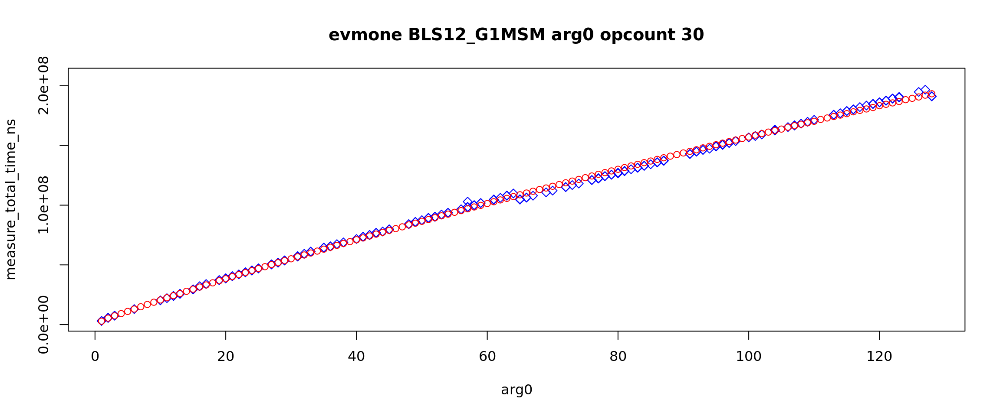
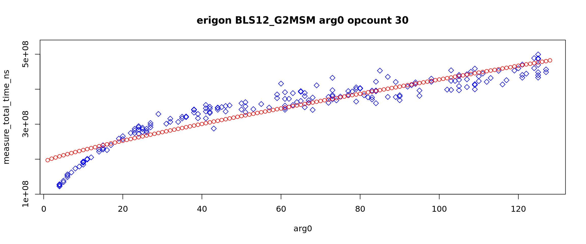
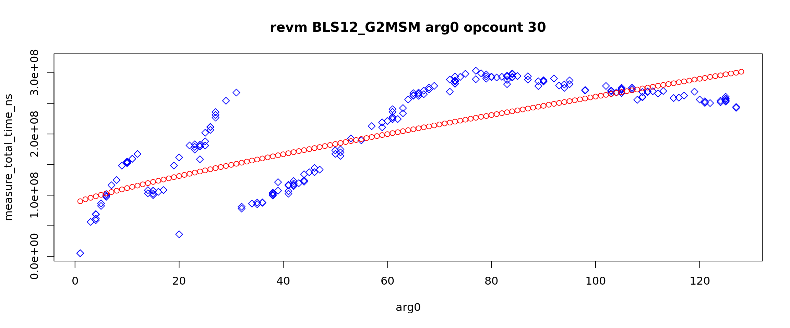

# Gas Cost Estimator

Stage 5 Report

## Abstract

Building on the methodologies and insights from previous stages (e.g., [Stage III](https://github.com/imapp-pl/gas-cost-estimator/blob/master/docs/report_stage_iii.md) and [Stage IV](https://github.com/imapp-pl/gas-cost-estimator/blob/master/docs/report_stage_iv.md)), this stage specifically focuses on the gas costs of operations on the BLS12-381 curve, as defined in [EIP-2537](https://eips.ethereum.org/EIPS/eip-2537). These operations underpin critical cryptographic functionalities in Ethereum, such as zero-knowledge proofs and aggregated signatures, making their cost evaluation essential for optimizing efficiency and security within the ecosystem.

## Scope

This report focuses specifically on the seven distinct precompile addresses introduced by EIP-2537, each corresponding to a fundamental operation over the BLS12-381 elliptic curve. These operations are:   

* `BLS12_G1ADD`: Point addition on the G1 curve.  
* `BLS12_G2ADD`: Point addition on the G2 curve.  
* `BLS12_G1MSM`: Multi-scalar multiplication (MSM) on the G1 curve.  
* `BLS12_G2MSM`: Multi-scalar multiplication (MSM) on the G2 curve.  
* `BLS12_PAIRING_CHECK`: Verification of elliptic curve pairings.  
* `BLS12_MAP_FP_TO_G1`: Mapping a field element (from Fp) to a point on the G1 curve.  
* `BLS12_MAP_FP2_TO_G2`: Mapping a field element (from Fp2) to a point on the G2 curve.

The scope of this analysis is strictly limited to the intrinsic computational cost of these cryptographic operations on various EVM clients. This implies that the evaluation deliberately abstracts away external factors and network-related overheads, such as the costs associated with state persistence or data storage. The primary objective is to ensure that the proposed gas costs accurately reflect the actual processing effort and CPU cycles consumed by EVM clients when executing these precompiled functions, providing a clear and direct measure of their computational intensity.   

## Methodology

The gas cost measurements for this stage were conducted using a benchmarking approach consistent with prior stages of the project. Each BLS12-381 operation was executed multiple times under controlled conditions, with execution times recorded to ensure reliability and repeatability.  
The benchmark programs were composed using test vectors from EIP-2537 as well as Ethereum test cases.   
Additionally, we created test cases that measure how various argument sizes affect the execution time. This is done in a similar manner as the previous research.

A cornerstone of this methodology is the scaling of all measured gas costs for BLS12-381 operations relative to the `ECRecover` precompile (address 0x01). This established precompile is assigned a fixed cost of 3000 gas units, serving as a consistent benchmark. This scaling approach is a well-precedented practice within Ethereum's gas schedule adjustments.

The conversion from execution time to gas cost was calculated using the following formula:  
`\text{gas} = \left( \frac{\text{execution time}}{\text{base time}} \right) \times \text{base gas}`  
Here, base time represents the execution time of the ECRecover precompile, and base gas is set at 3000 gas. This methodology ensures that the gas costs reflect the relative computational effort required by each operation.

TODO: add ECRecover scales for individual clients

## Analysis

The analysis is structured into subsections corresponding to the key BLS12-381 operations evaluated in this stage. Each subsection discusses the nature of the operation and the approach to measuring its gas cost.

### Pivot

ECRecover precompile is the pivot operation with 3100 gas cost. ECRecovery and BLS precompiles are executed in the set. The pivot operation measurements are a reference to determine gas cost for BLS precompiles.  
The choice of the pivot operation is based on its stability.

### Add (BLS12\_G1ADD, BLS12\_G2ADD)

The addition operations in the G1 and G2 groups of the BLS12-381 curve involve adding two points on their respective curves. The operations are priced at 375 and 600 gas respectively. As shown on the graph below, the EVM client implementations are actually slightly better than this.  
Still the differences are not large enough to call for a change in the pricing.  

### Multi-scalar Multiplication (BLS12\_G1MSM, BLS12\_G2MSM)

Multi-scalar multiplication computes the sum of multiple scalar multiplications of points on the G1 or G2 curves. The EIP-2537 expects the implementation of Pippenger’s algorithm, and prices the operations accordingly.  
The general formula is  

>`cost = (k * multiplication_cost * discount) / multiplier`

where  

>`k` is a number of pairs/multiplications  
>`multiplication_cost` is 12000 for G1 and 22500 for G2  
>`discount` is a value from the discount table and depends on k  
>`multiplier` is always 1000  

Note that this is not a linear formula. Thus a semi-linear regression is employed. That is defined as the problem of finding the best fit of the curve determined by the discount table to measurements.

The measurements significantly depend on the argument k \- the number of multiplications. Thus the arguments course is examined in details. There are two sets, 1-128 multiplications and 1-8 multiplications. The first gives a broad overview, as the discount table defined in EIP-2357 ranges to 128\. The latter is a closer look at a specific area \- the choice is based on experimental data.

Below are graphs for 1-128 arguments. The red dotted line is the fitted cost curve.

The client EvmOne has almost perfect match.  
The clients besu, erigon and geth have two modes: for low arguments and large arguments. Note that besu BLS12\_G2MSM has clearly lower measurements for k=1,2. For the low arguments optimizations are possible other than Pippenger’s algorithm and this is a reason for these two modes.  
The client Revm has unexpected measurements. Further investigation is needed to explain the phenomena.

The dilemma is whether the estimations from the low arguments mode or the estimations from the large arguments mode should be eligible for the gas cost proposal. The answer is not obvious and not final but from the network security perspective the latter is better. Of course operations with low arguments would be overpriced, and that is a drawback.

The side note is that the programs in the marginal course uses precompiles invocations with k=2 (BLS12\_G1MSM, BLS12\_G2MSM, BLS12\_PAIRING\_CHECK). It is not an issue for the pairing check, but for MSMs it is. The conclusion is that the argument’s gas cost estimation has greater importance in these cases.

### Pairing Check (BLS12\_PAIRING\_CHECK)

The pairing check operation verifies whether a set of pairings on the BLS12-381 curve satisfies a specific condition. The nominal cost formula is:  

>`cost = 37700 + k * 32600`

where  

>`k` is a number of pairs

### Mapping (BLS12\_MAP\_FP\_TO\_G1, BLS12\_MAP\_FP2\_TO\_G2)

Mapping field elements to points on the G1 and G2 curves is essential for utilizing the BLS12-381 curve in cryptographic applications. The gas cost is 5500 for Fp-to-G1 mapping and 23800 for Fp-to-G2.

Our analysis shows that the actual implementations fall not far from the nominal costs:

### Proposal

The table below summarizes the current gas costs for each BLS12-381 operation, and proposed gas cost based on our analysis.

>> TODO: provide proposed calculations including Nethermind results

| Operation | Current Gas | Proposed Gas |
| ----- | :---: | :---: |
| BLS12\_G1ADD | 375 |  |
| BLS12\_G2ADD | 600 |  |
| BLS12\_G1MSM | k\*12000\*discountG1(k) |  |
| BLS12\_G2MSM | k\*22500\*discountG2(k) |  |
| BLS12\_PAIRING\_CHECK | 37700+k\*32600 |  |
| BLS12\_MAP\_FP\_TO\_G1 | 5500 |  |
| BLS12\_MAP\_FP2\_TO\_G2 | 23800 |  |

## Conclusions

Stage 5 of the Gas Cost Estimator project has successfully measured the gas costs of key BLS12-381 curve operations within the EVM, as defined in EIP-2537. By scaling these costs relative to the ECRecover precompile, this report establishes a consistent framework for evaluating their computational demands. The findings highlight the varying resource requirements of operations such as addition, multi-scalar multiplication, pairing checks, and field element mappings, providing a foundation for potential gas cost adjustments.

### Recommendations

It is strongly recommended that the Revm team revises their MSM implementation. It has very good optimization for large k, but for k \< 32 some edge cases are exceeding the expected costs significantly.  
