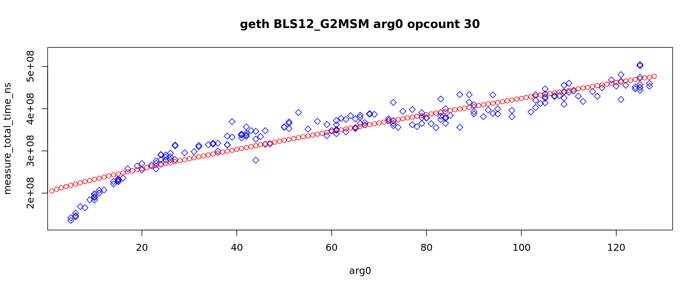
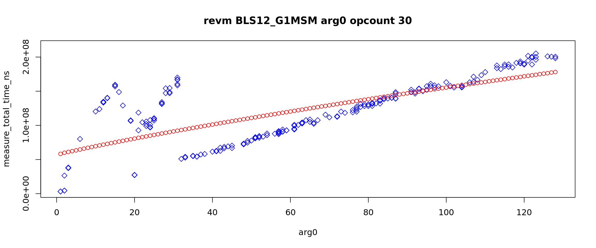

# Gas Cost Estimator

Stage 5 Report

## Abstract

Building on the methodologies and insights from previous stages (e.g., [Stage III](https://github.com/imapp-pl/gas-cost-estimator/blob/master/docs/report_stage_iii.md) and [Stage IV](https://github.com/imapp-pl/gas-cost-estimator/blob/master/docs/report_stage_iv.md)), this stage specifically focuses on the gas costs of operations on the BLS12-381 curve, as defined in [EIP-2537](https://eips.ethereum.org/EIPS/eip-2537). These operations underpin critical cryptographic functionalities in Ethereum, such as zero-knowledge proofs and aggregated signatures, making their cost evaluation essential for optimizing efficiency and security within the ecosystem.

## Scope

This report focuses specifically on the seven distinct precompile addresses introduced by EIP-2537, each corresponding to a fundamental operation over the BLS12-381 elliptic curve. These operations are:   

* `BLS12_G1ADD`: Point addition on the G1 curve.  
* `BLS12_G2ADD`: Point addition on the G2 curve.  
* `BLS12_G1MSM`: Multi-scalar multiplication (MSM) on the G1 curve.  
* `BLS12_G2MSM`: Multi-scalar multiplication (MSM) on the G2 curve.  
* `BLS12_PAIRING_CHECK`: Verification of elliptic curve pairings.  
* `BLS12_MAP_FP_TO_G1`: Mapping a field element (from Fp) to a point on the G1 curve.  
* `BLS12_MAP_FP2_TO_G2`: Mapping a field element (from Fp2) to a point on the G2 curve.

The scope of this analysis is strictly limited to the intrinsic computational cost of these cryptographic operations on various EVM clients. This implies that the evaluation deliberately abstracts away external factors and network-related overheads, such as the costs associated with state persistence or data storage. The primary objective is to ensure that the proposed gas costs accurately reflect the actual processing effort and CPU cycles consumed by EVM clients when executing these precompiled functions, providing a clear and direct measure of their computational intensity.   

## Methodology

The gas cost measurements for this stage were conducted using a benchmarking approach consistent with prior stages of the project. Each BLS12-381 operation was executed multiple times under controlled conditions, with execution times recorded to ensure reliability and repeatability.  
The benchmark programs were composed using test vectors from EIP-2537 as well as Ethereum test cases.   
Additionally, we created test cases that measure how various argument sizes affect the execution time. This is done in a similar manner as the previous research.

A cornerstone of this methodology is the scaling of all measured gas costs for BLS12-381 operations relative to the `ECRecover` precompile (address 0x01). This established precompile is assigned a fixed cost of 3000 gas units, serving as a consistent benchmark. This scaling approach is a well-precedented practice within Ethereum's gas schedule adjustments.

The conversion from execution time to gas cost was calculated using the following formula:  

>`gas = (execution_time / base_time) × base_gas`

Here, base time represents the execution time of the ECRecover precompile, and base gas is set at 3000 gas. This methodology ensures that the gas costs reflect the relative computational effort required by each operation.

TODO: add ECRecover scales for individual clients

## Analysis

The analysis is structured into subsections corresponding to the key BLS12-381 operations evaluated in this stage. Each subsection discusses the nature of the operation and the approach to measuring its gas cost.

### Marginal course

The marginal course uses a set of programs that differs with the number of examined operations and estimates the computation time of operations based on statistical methods as the result. The examination is performed thoroughly but no other dependencies are considered, in particular, arguments are fixed.

In all cases, a strong regression is obtained with a low relative standard deviation - BLS12\_G1MSM\_K0 and BLS12\_G2MSM\_K0 are special and discussed separately. That means that the estimated computational times of operations are very reliable. Below is an example of analysed results with a strong regression line, see the marginal reports for further details.

The operations BLS12_G1MSM, BLS12_G2MSM and BLS12_PAIRING_CHECK depend on input size, expressed by the argument k. In all cases the argument is set to k=2 as it includes both multiplication and addition. For BLS12_G1MSM, BLS12_G2MSM examinations with k=1 and k=0 are also provided but for further analysis the case k=2 is selected.

For the operations BLS12_G1MSM, BLS12_G2MSM the case k=1 is provided to compare the cases with and without addition. See the MSM section below for further investigation.

The case k=0 is provided to investigate a potential attack vector. The formula for the gas cost states clearly that such precompile invocation costs zero gas. The standard states (citation) "Also, the case when k = 0 is safe: CALL or STATICCALL cost is non-zero, and the case with formal zero gas cost is already used in Blake2f precompile". The CALL or STATICCALL costs 100 gas. But EIP-7904 proposes a significant drop of the cost to 5 so the network security assumptions may change. The tables below summarize the results for k=0 in two views: relative to k=1 and k=2 cases, and expressed as gas having cases k=1 and k=2 as the base.

| EVM BLS12_G1MSM | K0/K1 % | K0/K2 % | K0/K1 gas | K0/K2 gas |
|-----------------|---------|---------|-----------|-----------|
| besu            | -0.28   | 	-0.14  | -33.9     | 	-32.4    |
| erigon          | 0.03    | 	0.02   | 3.2       | 	4.8      |      
| evmone          | 0.00    | 	0.00   | -0.5      | 	-0.7     |     
| geth            | 0.21    | 	0.16   | 25.5      | 	37.0     |     
| nethermind      | 1.56    | 	1.19   | 187.7     | 	270.7    |    
| revm            | 0.02    | 	0.00   | 2.4       | 	0.5      |      

| EVM BLS12_G2MSM | K0/K1 % | K0/K2 %  | K0/K1 gas | K0/K2 gas |
|-----------------|---------|----------|-----------|-----------|
| besu            | -0.25   | 	-0.13   | -56.6     | 	-57.5    |
| erigon          | 0.02    | 0.01     | 3.5       | 	5.1      |      
| evmone          | 0.00    | 	0.00    | -0.5      | 	-0.7     |     
| geth            | 0.12    | 	0.10    | 26.4      | 	42.8     |     
| nethermind      | 0.82    | 	0.61    | 183.5     | 	273.0    |    
| revm            | 0.01    | 	0.00    | 2.3       | 	0.6      |

Note that negative values are valid - it means that an operation last less than invoking a warm empty non-precompile address.

### Relative cost to the EIP-2537 gas cost

The graph below presents the estimated computational time relatively to the EIP-2537 gas cost for each EVM. 
That is the computational time per 1 gas unit related to the evm's average.
The exact formula is

>`ect_per_gas = ect / EIP2537_gas_cost`

>`relative_ect_per_gas = ect_per_gas / AVG(each_evm.ect_per_gas)`

BLS12_G1MSM_ARG0 and BLS12_G2MSM_ARG0 are G1 and G2 multiplications - 12000 and 22500. BLS12_PAIRING_CHECK_ARGC is the constant of the pairing check - 37700 gas. The reference value is always 1 as the calculation is performed relatively to 1 gas unit.

The main outcome is that EIP-2537 gas cost is well-balanced. Most values are within &#177; 20%. This means that if the gas cost of one precompile would be adjusted, the others should be changed proportionally.

The remark worth to be noted are that BLS12_MAP_FP_TO_G2 is slightly overpriced and BLS12_G1MSM_ARG0 is slightly underpriced.

Please recall these values are not referred to ECRECOVER, they are self referred. Please note investigation on MSM below also for the full picture.

### Multi-scalar Multiplication (BLS12\_G1MSM, BLS12\_G2MSM)

Multi-scalar multiplication computes the sum of multiple scalar multiplications of points on the G1 or G2 curves. The EIP-2537 expects the implementation of Pippenger’s algorithm, and prices the operations accordingly. 
The general formula is  

>`cost = (k * multiplication_cost * discount[k]) / multiplier`

where  

>`k` is a number of pairs/multiplications  
>`multiplication_cost` is 12000 for G1 and 22500 for G2  
>`discount` is a value from the discount table and depends on k  
>`multiplier` is always 1000  

Note a sublinear dependency. Thus a semi-linear regression is employed in analysis. That is defined as the problem of finding the best fit of the curve determined by the discount table to measurements.

There are two measurements courses: the marginal and the arguments. The marginal course is more accurate, the arguments course investigate the dependency on the argument k - the number of pairs/multiplications. Finally, the results of marginal and arguments courses are compared. 

The marginal course consists of three cases: k=0, k=1 and k=2. The case k=0 is discussed above, and it is omitted in this section. The main difference between the cases k=1 and k=2 is that the latter requires addition. The reference gas cost of G1 MSM operation is 12000 for k=1 and 22776 for k=2, the reference gas cost of G2 MSM operation is 22500 for k=1 and 45000 for k=2. So the ratio is 1.898 and 2.0 for G1 MSM and G2 MSM operations respectively.

| EVM        | G1 reference ratio | G1 estimated ratio | G2 reference ratio | G2 estimated ratio |
|------------|--------------------|--------------------|--------------------|--------------------|
| besu       | 	1.898             | 	1.99              | 	2                 | 	1.97              |
| erigon     | 	1.898             | 	1.27              | 	2                 | 	1.36              |              
| evmone     | 	1.898             | 	1.49              | 	2                 | 	1.43              |              
| geth       | 	1.898             | 	1.31              | 	2                 | 	1.23              |              
| nethermind | 	1.898             | 	1.32              | 	2                 | 	1.34              |              
| revm       | 	1.898             | 	8.72              | 	2                 | 	7.43              |              

Note that EVMs are warmed up before measurements so it not the case that some software required initialization.

The measurements significantly depend on the argument k \- the number of multiplications. The gas cost formula includes discount factor which is non-linear and needs examination also.
There are two sets within the arguments course, 1-128 multiplications and 1-8 multiplications - in short the large and small arguments. Note that the discount table defined in EIP-2537 ranges to 128. The reason to investigate small arguments is the observation that most EVMs have different behaviour than for the large arguments. It may because of optimizations available for small arguments.

Below are graphs for large arguments. The red dotted line is the fitted cost curve according to the discount table - semi-linear regression.

The first observation is: revm results look chaotic. But repeated measurements yield similar shapes. So it is specific for the evm. There are three segments: 1-16, 16-32, 32-128. The point is that estimations are not reliable with such data. Although results G1 MSM in the segment 32-128 are in the line of expectation. Further investigation is needed to explain the phenomena.

The second observation is: besu, erigon and geth results have two modes. For small arguments the results are significantly lower. For erigon and geth it is 1-20 arguments, for besu it is 1-4 arguments. These results are visibly below estimated regression. For the small arguments optimizations are possible other than Pippenger’s algorithm and this is a reason for these two modes. Note that low results for small arguments affects the regression line - it would fit better to large arguments only. And that would confirm the discount table. 

This raises the dilemma: whether the results for small arguments should be taken into account for the gas cost estimations or not. The results for large arguments cannot be neglected as this could make the gas cost for large arguments underpriced and undermine the network security. Of course operations with low arguments would be overpriced, and that is a drawback. The decision is to use all arguments for the estimation. But it is not obvious and possibly not final.

The third observation is: evmone and nethermind have almost perfect match to the estimated regression. This confirms the discount table. Note that the two evms have higher results for 32-64 arguments. The reason for that is uncertain.

### Pairing Check (BLS12\_PAIRING\_CHECK)

The pairing check operation verifies whether a set of pairings on the BLS12-381 curve satisfies a specific condition. The nominal cost formula is:  

>`cost = 37700 + k * 32600`

where  

>`k` is a number of pairs

There are two measurements courses: the marginal and the arguments. The marginal programs assume the argument `k=2` so the reference gas cost is 102300. The arguments course investigates the dependence on `k` only. Note that the gas cost formula consists of the constant cost and the argument cost. Finally, the results of marginal and arguments courses are compared. 

In all cases of the argument course a strong regression is obtained with a low relative standard deviation. That means that the estimated computational times of the constant and argument components are very reliable. Below is an example of analysed results with a strong regression line, see the arguments reports for further details.

The latter image presents the series of programs with 0 operations per program (wheat color), 15 operations per program (green color) and 30 operations per program (blue program). A proportional linear distance between the series is expected.

The results are scaled relatively to the argument cost in the table below.  

| EVM        | the argument cost (ref 32600) | the constant cost (ref 37700) | % | the marginal estimation (ref 102300) | % |
|------------|-------------------------------|-------------------------------|---|--------------------------------------|---|
| besu       | 32600                         | 	42691.3                      | -13.2	                     | 107315.5                             |	-4.9    |
| erigon     | 32600                         | 	41980.8                      | -11.4	                     | 107820.0                             |	-5.4    |
| evmone     | 32600                         | 	30650.8                      | 18.7	                      | 95716.7                              |	6.4       |
| geth       | 32600                         | 	42210.4                      | -12.0	                     | 106310.6                             |	-3.9    |
| nethermind | 32600                         | 	29808.5                      | 20.9	                      | 95525.8                              |	6.6       |
| revm       | 32600                         | 	44145.6                      | -17.1	                     | 99246.3                              |	3.0      |

Assuming the argument cost is the reference value, the calculated constant cost diverges &#177; 20% from the expected value, and the estimated cost of precompile in the marginal course diverges &#177; 6% from the expected value. The latter proves methodology and the great consistency between these two courses. The former indicates quite good balance between the constant cost and the arguments cost.

### Pivot

ECRecover precompile was selected as the pivot operation for this research. The pivot operation is the reference to verify the gas cost for BLS precompiles against to. Literally, 3100 gas is considered as the cost for ECRecovery operation. So, ECRecovery and BLS precompiles are executed in the set.

ECRecovery precompile was analysed in the stage 4 of the Gas Cost Estimator project and is discussed in EIP-7904.

### Proposal

The table below summarizes the current gas costs for each BLS12-381 operation, and proposed gas cost based on our analysis.

>> TODO: provide proposed calculations including Nethermind results

| Operation | Current Gas | Proposed Gas |
| ----- | :---: | :---: |
| BLS12\_G1ADD | 375 |  |
| BLS12\_G2ADD | 600 |  |
| BLS12\_G1MSM | k\*12000\*discountG1(k) |  |
| BLS12\_G2MSM | k\*22500\*discountG2(k) |  |
| BLS12\_PAIRING\_CHECK | 37700+k\*32600 |  |
| BLS12\_MAP\_FP\_TO\_G1 | 5500 |  |
| BLS12\_MAP\_FP2\_TO\_G2 | 23800 |  |

## Conclusions

Stage 5 of the Gas Cost Estimator project has successfully measured the gas costs of key BLS12-381 curve operations within the EVM, as defined in EIP-2537. By scaling these costs relative to the ECRecover precompile, this report establishes a consistent framework for evaluating their computational demands. The findings highlight the varying resource requirements of operations such as addition, multi-scalar multiplication, pairing checks, and field element mappings, providing a foundation for potential gas cost adjustments.

### Recommendations

It is strongly recommended that the Revm team revises their MSM implementation. It has very good optimization for large k, but for k \< 32 some edge cases are exceeding the expected costs significantly.  
